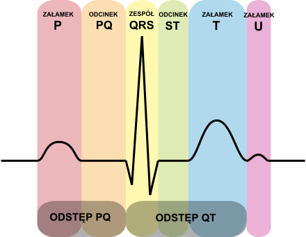
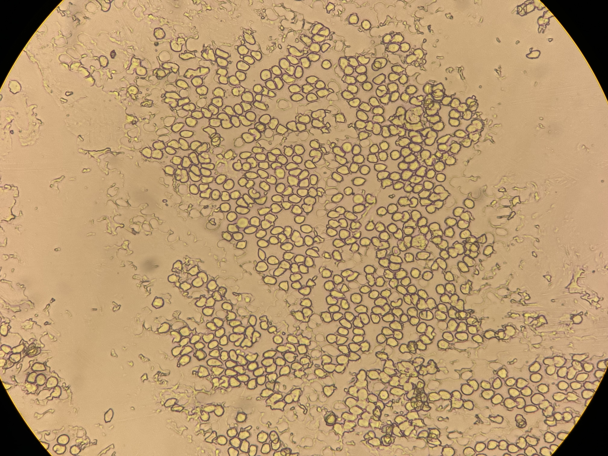
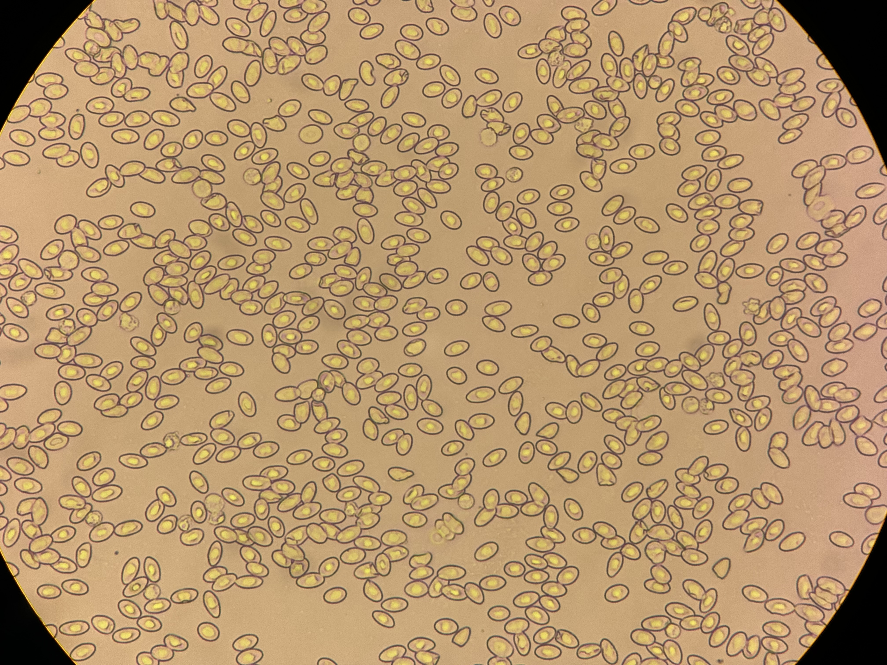
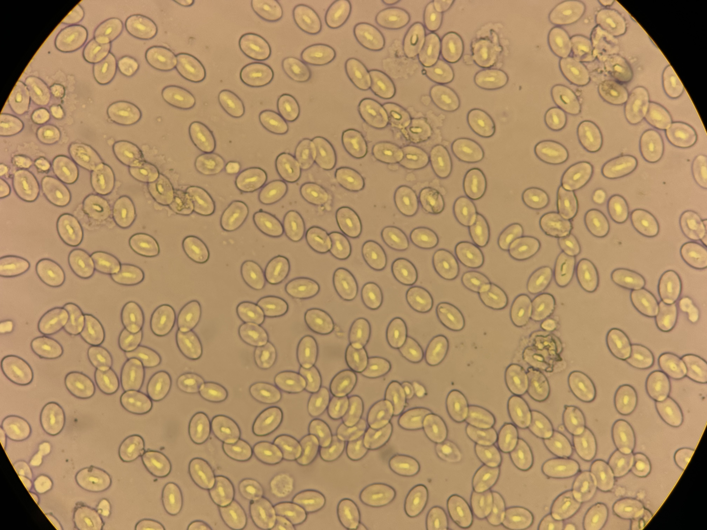
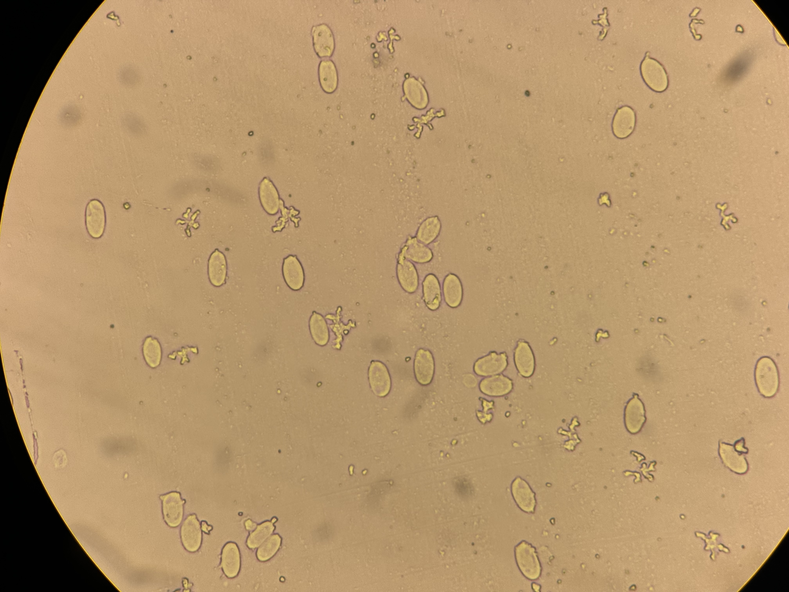

# Tkanka mięsniowa

## Komórka mieśniowa
- zdolnosc przrewodzenia fali pobudzenia
- pobudliwosc (zdolnosc reakcji na bodzce)
- kurczliwosc

## Rodzaje
- miesnie poprzecznie prazkowane
  - miesnie szkieletowe
  - miesien serocowy
- miesnie gladnie

## Miesnie poprzecznie prazkowane
### Cechy miesni szkieletowych

- przyczepione do szkieletu kostnego tworza aparat ruchu
- utrzymuja postawe ciala
- poruszaja galka oczna
- kurcza się od woli
- sa unerwione przez nerwy somatyczne
- stanowia 40-48% masy dziala
- kurcza sie szybko przy wysokim nakladzie energii

### Włukna poprzecznie prazkowane miesnia szkieletowego

<Obrazek>

### Prazki izo- i anizotropowe

- wystepuja naprzemienne
- A
  - ciemne
- I
  - jasne

### Komórka

Sarkomer - najmniejsza jednostka funkcjonalna komórki mieśniowej (dwie linie Z)

### Energia skurczu miesnia szkieletowego

- bezposrednie zrodlo energii dla skurczu: ATP (zapas starcza na 1-2s)
- zasoby ATP sa odnawialne ADP -> ATP (fosfokreatyna)
- odbudowa zapasow jest realizowana przez glikogen i tlen
- kiedy nie ma tlenu wytwarza sie kwas mlekowy (mniejsza wydajnosc energetyczna)

### Dług tlenowy

### Siateczka sarkoplazmatyczna - Uwalnianie wapnia

Siateczka sarkoplazmatyczna jest to wyspecjalizowany system blon wiazacay jony $Ca^{2+}$ w czasie spoczynku miesni i uwalniajacy je w chwili dotarcia impulsu nerwowego.

### Typy miesni szkieletowych

- Typ I (czerwone, S) - powolne, o przewadze metabolizmu tlenowego
  - Wolno sie kurczy, powoli sie meczy, skurcze niezbyt silne
- Typ IIa (jasnoczerwone, FR) - szybkie, o przewadze metabolizmu tlenowego
  - szybko sie kurcza, srednia sila skurczy, odporne na zmeczenie
- Typ IIb (białe, FF) - szybkie, o przewadze metabolizmu beztlenowego
  - silne, szybkie lecz krótkotrwałe skurcze tężcowe, szybko się męcza

### Jednostka motoryczna

Zespol komorek miesnia szkieletowego unerwianych przez te sama komorke nerwowa.

### Roznice w wielkosci jednostek motorycznych

- Mala - galka oczna
- Duze - miesnie postawy

### Bodźce

- Bodziec progowy - pobudza jedynie jednostki motoryczne o najnizszym progu pobudliwosc
- Bodziec nadprrogowy - -/- o najwyzszym progu pobudliwosci
- Bodziec maksymalny - pobudza do skurczu wszystkie jednostki motoryczne w miesniu
- Bodziec podprogowy - sa za slabe zeby wywolac skurcz

## Miesnie gladkie

_Wyscielaja wewnetrzna czesc organizmu._

### Występowanie

- w scianie naczyn krwionosnych
- w scianie narzadkow ukladu pokarmowego i oddechowego
- w narzadach moczowych i plciowych
- w przewodach wyprowadzajacych gruczolow
- w galce ocznej
- w skorze

### Wlasciwosci

- kurcza sie niezalenie od woli
- sa unerwione przez uklad nerwowy autonomiczny
- kurcza sie wolno przy niskim zuzyciu energii
- skurcze moga byc spowodowane roznymi rodzajami bodzcow
  - nerwowymi
  - mechanicznymi
  - chemicznymi
  - hormonalnymi
  - pochodzacymi z komorek rozrusznikowych

### Energetyka skurczu miesnia gladkiego

- skurcz regulowany jest przez jony wapnia

### Rodzaje skurczow miesni szkieletowych w zaleznosie od zmian dlgosci i napiecia

- Skurcz izometryczny - zmienia napiecia bez zmienia dlugosci (nie mozemy podnieśc)
- skurcz izotoniczny - zmienia dlugosc natomiast napiecie nie ulega zmianie
- skurcz autksotoniczny - typowy skurcz dla czynnosci miesniowych
  - I: faza skurczu izometycznego
  - II: faza izotoniczna

# Układ nerwowy

Uklad kontrolujacy prawie wszystkie czynnosci organizmu przez:
- odbieranie
- przekazywanie
- ocene i przetwarzanie
- gromadzenie (mózg)
- wysylanie do narzadow docelowych

..informacji ze srodowiska wewnetrznego i zewnetrznego

## Podzial

- Centralny (Osrodkowy) Uklad Nerwowy
  - Mozg
  - rdzen kregowy
- Obwodowy
  - Nerwy czaszkowe, korpusu i konczyn

## Czesci funkcjonalne

- uklad somatyczny
  - kieruje praca miesci szkieletowych, gruczolow skurnych i komorek skory
  - nastawiony na lacznosc ze swiatem
- uklad autonomiczny
  - unerwia narzady wewnetrzne
  - kontroluje czynnosci miesni gladnych, miesnia sercowego, narzadow wewnetrznych i gruczolow

## Neuron

podstawowa jednostka strukturalna i czynnosciowa ukladu nerwowego

### Wlasciwosci

- pobudliwosc (zdolnosc reagowania na bodzce)
- przeowdzenie pobudzenia
- przewodzenie impulsu odbywa sie od dendrytow przez cialo komorki do neurytu (synapsa - miejsce styku komorek)

Oslona mielionowa - przyspiesza predkosc impulsow

### Budowa

- Dendryt - orzewodzenie do komorki
- Akson - przekazywanie informacji dalej
- Synapsy - na zakonczeniach aksonu
  - Nerwowo-nerwowa
  - Nerwowo-miesniowa
  - Nerwowo-gruczolowa
  - Synapsa elektryczna
  - Synapsa mechaniczna

### Łuk odruchowy

Jest to automatyczna reakcja narzadu wykonawczego na bodziec zewnetrzny lub wewnetrzny zachodzaca i kierowana przez uklad nerwowy.

#### Czesci skladowe

- receptor
  - struktura majaca zdolnosc do obierania informacji
  - receptor zmienia bodzce na impulsy nerwowe
  - receptor jest wysoko-specyficzny per zmiana srodowiskowa
- droga doosrodkowa (protoneuron czuciowy)
  - neuron czuciowy
  - przewodzi pobudzenie z receptoru do osrodka
  - tworzy synapse z kolejna komórkowa nerwowa
- osrodek (tu integracja odruchu)
  - proste odruchy - rdzen kregowy
  - zlozone odruchy - czesc glowna + czesc rozsiana w CUN
  - integracja informacji
  - decyzja o sile reakcji
- droga odosrodkowa neuron (motoneuron motoryczny)
  - Neurony ruchowe somatyczne i autonomiczne
  - przekazuja pobudzenie w postaci impulsu nerwowego do narzadow wykonawczych
- narzad wykonawczy
  - efektor
  - komorka miesniowa, gruczolowa
  - reaguje pobudzeniem na impuls zstepujacy

# KOLOKWIUM
- [WYKRESY] POROWNANIE SKURCZ M. SZKIELETOWEGO Z M. GLADKIM
- CHARAKTERYSTYKA K. MIESNIOWEJ
- SIATECZKA SARKOPLAZMATYCZNA
- SARKOMER
- JEDNOSTKA MOTORYCZNA
- ROCZAJE SKURCZOW
- SKLADOWE RUCHU ŁUKU ODRUCHOWEGO I CHARATERYSTYKA SKŁADOWYCH

### Synapsy

Czynnosciowe potaczenie neuronu z:
-innym neuronem,
-receptorem czuciowym,
-komórkami efektorowymi (miesniowymi lub gruczotowymi)

#### Rola synapsy jest przekazywanie sygnatów

Impuls nerwowy zostaje preniesiony z jednej komórki na druga przy udziale substancji o charakterze neuroprzekaznika (zwanego czasem neurohormonem) lub na drodze impulsu elektrycznego (synapsy elektryczne)

#### Synapsy - schemat

#### Synapsy - rodzaje

nerwowo-nerwowe
nerwowo-miesniowe
nerwowo-gruczolowe

chemiczne (szczelina synaptyczna ok. 20nm)
elektryczne (szczelina synaptyczna ok. 2 nm)

hamujce -80-90mV
pobudzajace -70-60mV

#### Synapsa elektryczna

- Potoczenie szczelinowe.
- Bietta obeksomow bonie pre- i postsynaptyczne worza koneksony - pory taczace wnetrza obu komórek
- Odlegtosc miedzy bonami komórkowymi bardzo mata (3-5 nm).
- Potencjat czynnosciowy prenoszony bez udziatu mediatora, bardzo szybko (us).
- Przekaznictwo dwukierunkowe
- Znikome mozliwosci regulacji sygnatu.
- Wystepuja w miesniach, siatkowce oka czesci korowej mózgu oraz w niektorych czesciach serca.

#### Synapsa chemiczna

- Blony pre- i postsynaptyczne zróznicowanie czynnosciowo.
- Wieksza odlegtosc miedzy otonami (20 - 40 nm),powstaje prestrzen synaptyczna, ograniczona po bokach przez wypustki komórek glejowych.
- Prewodzenie przez synapse wolniejsze (0,5 - kilka ms).
- Sygnał przekazywany za pomoca mediatora, znaczne mozliwosci regulaci.

#### Przewodzenie pobudzenia:

Potencjat czynnosciowy → Otwarcie kanatów Ca?+ → Naptyw jonów wapniowych do wnetrza → Potaczenie pecherzyków synaptycznych z miejscami aktywnymi → Uwolnienie mediatora → Zwiazanie mediatora z receptorem → Otwarcie kanatów jonowych dla Na+ (lub Cl-) → Powstanie postsynaptycznego potencjatu pobudzajacego (lub hamujacego) → Otwarcie kanatów Nat zaleznych od napiecia → Powstanie potencjatu czynnosciowego w bonie postsynaptycznej

### Potencjały

#### Potencjat blonowy

Róznica potencjatów pomiedzy wnetrzem komórki i jej otoczeniem. Przyjmujemy, ze potencjat po zewnetrznej stronie bony wynosi zero (obowiazujaca konwencja). Napiecie pomiedzy obu stronami bony jest po prostu potencjatem wnetrza komórki mierzonym wzgledem jej otocze nia.

#### Potencjał spoczynkowy

- Cecha komórek pobudliwych jest posiadanie stałego, ujemnego, spoczynkowego potencjatu bonowego.
- Wnetrze komórki zawiera wiecej jonów ujemnych wzgledem jej otoczenia (róznica tadunku elektrycznego).
- Stan równowagi dynamicznej.

Potencjat spoczynkowy:
Neuron: od -60 do -70mV
Miesien poprzecz. prazkowany: -95mV
Miesien gladki: -60mV
Fotoreceptor: -40mV

hamujce -80 do -90mV
pobudzajace -70 do -60mV

Nierównomierne rozmieszczenie jonów nieorganicznych miedzy cytoplazma a toczeniem komórki - aniony biatkowe, Nat, K+, Cl-, Ca2+

Cytoplazma komórki:
30x wiecej jonów K+ (140 mmol/I)
10x mniej jonów Na+ (14,5 mmol/I)
10x mniej jonów Cl - (4 - 20 mmol/I)
Aniony biatkowe nie transportowane prez blone komórkowa.

K+ - wedrówka na zewnatrz prez kanaty jonowe
Na+ - nie moga predostac sie do komórki, dlatego tworza warstewke tadunku dodatniego na zewnatrz komorki
Cl - naptywaja do komórki na wymiane z K+; wedruja na zewnatrz za jonami Na+
Aniony biatkowe - pozostaja wewnatrz komórki

Rónica potencjalu wynika z:
1. Róznicy stezen jonowych, glównie jonów Nat i K+ po obu stronach blony komórkowej.
2. Dyfuzji tych jonów prez blone zgodnie z ich gradientami stezen (tzw. potencjat dyfuzyjny).
3. Selektywnej prepuszczalnoscia btony wzgledem tych jonów.
4. Obecnosci pompy sodowo-potasowej.

### Mechanizm pompy jonowej

#### Na-K-ATPaza (Ważne)
Pompa przenosi równoczesnie 3 jony Na+ na zewnatrz i 2 jony K+ do wewnatrz z uzyciem 1 czasteczki ATP

Dziatanie pompy wymaga:
- statego doptywu glukozy i tlenu
- ciagtej syntezy ATP
- zachowania temperatury okoto 37 °C
- odprowadzania CO2
- odpowiedniego stezenia jonów Mg2+
- odpowiedniego stezenia jonów Na+ i K+

Zatrzymanie pompy prowadzi do:
- zmian sktadu plynu wewnatrzkomórkowego
- zmian sktadu plynu zewnatrzkomórkowego, kórym stezenie jonów Na* mnieisza sie i zwieksza
- utraty przez komórki specyficznych wtasciwosci
- braku reakcji komórek na bodzce
- ich niepobudliwosci

Czynniki hamujace dzialanie pompy, to m.in.:
- hipoksja;
- spadek temperatury;
- inhibitory oddychania komórkowego;
- wybiórcze zahamowanie pompy.

### Potencjaty - czynnosciowy

Przejsciowa zmiana potencjatu błonowego komórki, co wiaze sie z przekazywaniem informacji w układzie nerwowym.

Depolaryzacja bony komórkowej komórki pobudliwej pod wpływem bodzica, po której nastepuje repolaryzacja.

Bodziec - zmiana zachodzaca w srodowisku wewnetrznym lub zewnetrznym powodujaca zmiane wlasciwosci bony komórkowej lub metabolizmu wewnatrzkomórkowego.

Komórka nerwowa reaguje pobudzeniem lub zahamowaniem w odpowiedzi na bodziec.

Pod wpływem bodzcow podprogowych sumujacych sie czasowo lub przestrzennie lub bodzca progrowego dochodzi do zmniejszenia roznicy potencjalow do okoto -45 do -60 mV. Jest to potencjat progowy (krytyczny).

W tym momencie:
- Otwarcie kanatów dokomórkowych dla Na+
- Zmiana potencjatu błonowego o 100mV
- Powstaje potenciat iglicowy
- Teraz otwieraja sie kanaty odkomórkowe dla K+
- Repolaryzacja
- Hiperpolaryzacja
- Pompa Na-K przywraca wyjsciowy rozkład jonów
- Ustalenie potencjalu spoczynkowego

Gdy na brone komórkowa dziata seria bodzcow podprogowych jeden po drugim, kazdy z nich podnosi potencjat blonowy, az kolejny staje sie bodzcem progowym, zjawisko to nazywamy sumowaniem w czasie.

Gdy na btone komórkowa dziata jednoczesnie duza liczba bodiców podprogowych zjawisko to nazywamy sumowaniem w przestrzeni.

<obrazek na zaliczenie, reakcja na bodziec>

Potencjat czynnosciowy prenoszony jest wzdłuz wrokna nerwowego.

Zdepolaryzowany odcinek pobudza dalej potozona czesc wrokna, jeszcze spolaryzowana, a nastepnie sam ulega repolaryzacji.

Refrakcja bezwzgledna komórka nie jest w stanie odpowiedziec na zaden bodziec (nie mozna wygenerowac potencjalu czynnosciowego) (Kanaly Na+ )

Refrakcja wzgledna potrzeba silniejszego bodica aby wywotac ponowny potencjat czynnosciowy

# Układ sercowy

## Własciwosci miesnia sercowego

Wtókna miesnia sercowego (miocyty) sa ciensze niz miesnia skieletowego oraz ułozone nieregularnie, tworza siec, jadra rozmieszczone sa w czesci centralnej komórek, prewazaja mitochondria.

Łacznosc pomiedzy komórkami zapewniaja wstawki, które tacza koniec i czesc boczna sciany jednego z miocytu z koncem czesci bocznej sciany sasiedniej komórki miesniowej. W czesci wstawki biegnacej równolegle do osi komórki miesniowej szczelina pomiedzy podwójna warstwa lipidowa zanika a w prylegajacych do siebie warstwach tworza sie kanaty tzw. koneksony.

Koneksony zapewniaja szybko rozprzeszczeniajacy sie potencjat czynnosciowy po całym miesniu sercowym. Umozliwiaja one depolaryzacje i aktywacje kanatów Na+ oraz minimalizuja opornos potaczen pomiedzy miocytami.

Mechanizm powstawania i szerzenia sie pobudzenia we wtóknach miesnia sercowego jest zblizony do wystepujacego w miesniach szkieletowych i nerwowych. Ró¿nica polega na tym ¿e bodice pobudzajace skurcz miesnia sercowego generowane sa w komórkach rozrusznikowych.

Potencjat spoczynkowy wtókien miesnia sercowego wynosi od -85 do -95 mV.

Podczas pobudzenia potencjat rosnie do + 30 mV. Prejscie potencjatu z ujemnego na dodatni to depolaryzacja spowodowana prepuszczaniem jonów sodowych co w konsekwencji powoduje przejsciowa utrate pobudliwosci.

Przypada to na okres skurczu (refrakcja bezwzgledna - ok. 200 ms). Nastepnie dochodzi do stopniowej repolaryzacji, w pewnym etapie stabe bodice nie wywotuja pobudzenia a silne bodice moga powodowac skurcz dodatkowy (okres refrakcji wzglednej - ok. 30 ms).

- reaguje według prawa „wszystko albo nic"
- kurczy sie tylko skurczami pojedynczymi (brak skurczu teicowego)
- po pobudzeniu wystepuje dugotrwata refrakcja bezwzgledna - brak pobudliwosci prez caty okres skurczu, zwiazany z tym jest odmienny kształt potencjału czynnosciowego
- automatyzm - wytwarza rytmiczne bodzce dla samego siebie, nerwy tylko reguluja prace serca
- kurczy sie jedynie w atmosferze tlenu. Brak statego doptywu tlenu powoduje zawat, nie moze zaciagac diugu tlenowego

## Potencjat czynnosciowy miesnia sercowego

- faza 0 (szybka depolaryzacja) - zalezy od szybkiego dosrodkowego pradu sodowego
- faza 1 (wstepna szybka repolaryzacja) - dosrodkowy prad chlorkowy i odsrodkowy prad potasowy
- faza 2 (powolna repolaryzacja) - tzw. faza plateau (stabilizacja potencjatu równowaga pomiedzy dosrodkowym pradem wapniowo-sodowym a odsrodkowym stabym pradem potasowym)
- faza 3 (szybka repolaryzacja) - prewaga odsrodkowego pradu potasowego nad wygasajacym dosrodkowym pradem wapniowo-sodowym
- faza 4 (polaryzacja) - faza spoczynku, polaryzacji.

## Zastawki

W sercu wyróznia sie zastawki:

- przedsionkowo-komorowe:
  - przedsionkowo-komorowa lewa (mitralna, zastawka dwudzielna)
  - przedsionkowo-komorowa prawa (trójptatkowa, dwuptatkowa zastawka trójdzielna)

- pótksiełycowate:
  - zastawka aorty
  - zastawka pnia płucnego

## Struny sciegniste

Struny sciegniste to twory w postaci nitek taczace miesnie brodawkowate komór serca z platkami zastawek - zapobiega wywijaniu sie zastawek w czasie ich pracy.

## Struny rzekome

Struny rzekome maja budowe podobna do strun sciegnistych. Moga byc strunami sciegnistymi nie pryczepionymi do miesnia brodawkowego lub moga taczy miesnie brodawkowate z tatkami zastawek, poprzecznie.

## Kardiogram zaby

Krew spetnia swe ztozone funkcje w organizmie dzieki ciagtemu krazeniu w zamknietym (u zwierzat wyzszych) uktadzie naczyn krwionosnych. Narzadem utrzymujacym nieprzerwany preptyw krwi jest serce, tworzace z naczyniami jedna catos anatomiczna, i czynnosciowa. W uktadzie krazenia krwi rozrózniamy krazenie plucne (obieg maty) i systemowe (obieg duzy).

## Układ krowionosny u zwierzat

- Krwioobieg duzy:
  - lewa komora serca
  - aorta
  - duze i srednie tetnice
  - tetniczki
  - siec naczyn wtosowatych we wszystkich narzadach oprócz pluc
  - zytki
  - srednie i duze zyty
  - zyty glówne
  - prawy przedsionek serca.

CEL: doprowadzenie
tlenu i substancji odzywczych do tkanek i
odprowadzenie metabolitów (a takze
rozprowadzanie innych substancji, np.
hormonów).

- Krwioobieg maty:
  - prawa komora
  - pien plucny
  - tetnice plucne
  - tetniczki
  - siecnaczyn wtosowatych pluc
  - zytki
  - zyty plucne
  - lewy przedsionek.

CEL: natlenienie krwi w
plucach i wydalenie dwutlenku wegla.

## Wpływ hormonow, czynnika termicznego i nerwu blednego na czestosc akcji serca

Serce kurczy sie automatycznie jednak podlega tez nerwowej i hormonalnej (humoralnej) regulacji. Uktad nerwowy osrodkowy reguluje czynnosc serca poprzez wtokna uktadu przywspótczulnego i wspótczulnego.

Uktad wspótczulny pryspiesza prace serca.

Uktad przywspótczulny zwalnia prace serca.

U zwierzat statocieplnych wtókna przywspotczulne biegna do serca w nerwie brednym.

### Wplyw hormonow

Adrenalina i noradrenalina, sa mediatorami pobudzen w zakonczeniach wókien zazwojowych w uktadzie wspótczulnym. Tam gdzie mediatorem jest acetylocholina, uktad nazywamy uktadem cholinergicznym, do którego naleza Zakonczenia wtókien przed- i zazwojowych prywspótczulnych i ptytki motoryczne, w przypadku zas katecholamin jako mediatora, uktad nazywamy andrenergicznym; naleza do niego zakonczenia wtókien zazwojowych sympatycznych.

### Wplyw czynnika termicznego

Do czynników zmieniajacych bardzo wyraínie czynnos serca nalezy temperatura. Wszystkie zyciowe funkcje tkanek, zmieniaja sie pod wptywem zmian temperatury (w okreslonym zakresie). Zgodnie z prawem van't Hoffa wrost temperatury o 10 °C przyspiesza 2- 3- krotnie prebieg reakcji chemicznych. Prawo to odnosi sie wiec równiez do procesow biochemicznych, zachodzacych w tkankach. Wrost temperatury orzyspiesza czynñosc serca, obnizenie temperatury ja zwalnia.

## Cykl pracy serca (Ważne)

1. Skurcz przedsionków - dopetnia komory krwia
2. Skurcz komór - wzrost cisnienia krwi w komorach, krew ptynie w strong przedsionków, gdzie panuje nizsze cisnienie;
3. Zatrzaskuja sie zastawki przedsionkowo komorowe, stychac pierwszy ton serca - długi i dźwieczny (bum);
4. Cisnienie w komorach nadal rosnie, krew napiera na wszystkie 4 zastawki.
5. Kiedy cisnie w komorach przewy¿szy cisnienie w tetnicach, otwieraja sie zastawki pótksiezycowate aorty i pnia ptucnego, a nastepuje wyrzut krwi z komór do tych tetnic.
6. Rozkurcz komór i spadek w nich cisnienia.
7. Krew cofa sie z tetnic do komór - w kierunku nizszego cisnienia.
8. Poniewaz cisnienie krwi w rozkurczajacych sie komorach wciaz spada, w koncu staje sie nizsze niz w przedsionkach, wskutek czego otwieraja sie zastawki przedsionkowo- komorowe i krew zaczyna naptywac do komór:
9. Skurcz przedsionkow - dopetnia komory krwia.

## Tony serca

Przy kazdym skurczu serca styszy sie nad klatka piersiowa zjawisko akustyczne o roznej czestotliwosci (30-70 Hz). Powstajace w czasie cyklu serca z powodu drgan zastawek i scian serca.

Szmery serca sa wywolywane prez niedomykajace sie (lub czesciowo zrosniete) zastawki.

ton I - skurczowy (systoliczny) - dtuzszy i nizzy (150 ms, 25-45 Hz) - sktada sie z drgan zamykanych zastawek przedsionkowo-komorowych, argan scian napinajacego sie serca i argan scian aorty i pnia plucnego podczas wyrzutu krwi

ton II - rozkurczowy (diastoliczny) - krótszy i wyzszy (120 ms, 50 Hz) - sktada sie, z drgan zamykanych zastawek pólksiezycowatych i wibracji obu pni tetniczych

ton III (protodiastoliczny) - cichy (wystuchiwany tylko u mtodych osob), 35 Hz. - pochodzacy od drgan scian komór wywotanych nagtym rozciagnieciem (faza wypelniania komór)

## Osłuchiwanie tonów serca

• zastawka tetnicy ptucnej - trzecia przestrzen miedzyzebrowa (pmz.) po stronie lewej klatki piersiowej

• zastawka aorty - czwarta pmz. po stronie lewej klatki piersiowej,

• zastawka dwudzielna - piata pmz. po stronie lewej klatki piersiowej

• zastawka trójdzielna - trzecia pmz. po stronie prawej klatki piersiowej.

• Ostuchiwanie tonów serca jest podobne u psa, kota oraz konia i bydta

## Badanie czestości tętna

Sposób badania tetna: palpacja opuszkami palców wskazujacego i srodkowego, jednoczesne ostuchiwanie serca czas trwania badania: 30-60 s tetnica szyjna:
• lekkie zgiecie gtowy w kierunku badanej strony
• dolna czesc szyi przysrodkowo

U konia tetno badamy na tetnicy szczekowej (we wcieciu naczyniowym Zuchwy). U krowy na tetnicy twarzowej i udowej, a u psa i owcy na tetnicy udowej.

### Sktadowe tetna to:
- tetno objetosciowe (samo rozciagniecie aorty),
- tetno cisnieniowe (zwiekszenie napiecia sprezystego sciany aorty i wzrost cisnienia w jej swietle),
- tetno przeplywowe (przyspieszenie predkosci pradu krwi).

### 5 cech gtównych tetna
1. Czestosc
2. Miarowosc
3. Wielkosc (Wypelnienie)
4. Napiecie
5. Chybkosc

Czestosc - jest wyrazem czestosci skurczów serca; moze byc tetno czeste i rzadkie (pulsus frequens i rarus), u ludzi wynosi ok. 70, u koni 28-40, u krowy 40-80, malych prezuwaczy 70-80, u swini 60-80, a u psów 60-120 uderzen na minute. Zwierzeta duze maja tetno rzadsze niz zwierzeta mate, np. ston 20/min, a mysz 500/min. Im zwierze, mtodsze, tym tetno jest szybsze, np. ¿rebie 6-12 miesieczne ma ok. 70 uderzen/min.

Miarowosc - Tetno moze byc miarowe, gdy odstepy czasu pomiedzy poszczególnymi falami sa równe oraz niemiarowe, gdy odstepy te nie sa równe

Wielkosc- zalezy od stopnia roszerzenia tetnicy (tetno duze i male)
Tetno duze: fala pelna, unoszaca opuszki palców (nadcisnienie tetnicze, goraczka,
niedomykalnosc aortalna)
Tetno mate: fala niska, stabo wyczuwalna (hipowolemia, zwezenie zastawki aortalnej)
- tetno nitkowate: tetno mate i czeste (wstrzas)

Napiecie - czyli twardos tetna - zalezy od cisnienia krwi w tetnicach. Dzielimy je na
twarde (durus) oraz miekkie (mollis). Miara napiecia jest sita ucisku palca, powodujaca
wstrzymanie fali tetna.

Chybkosc - szybkosc podnoszenia sie i opadania tetnicy

Tetno chybkie (zazwyczaj tez duze) - niedomykalnosc zastawki aortalnej
Tetno leniwe (zazwyczaj tez mate) - zwezenie zastawki aortalnej , miazdzyca

### Zwiekszenie czestosci tetna

Fizjologiczny (m.in. wiek, wysitek fizyczny, stan emocjonalny)
Patologiczny (m.in, choroby serca, nerwica, wzrost temperatury ciala o 1 st. C powoduje wzrost tetn o 10-20 u/min)

### Obnizenie czestosci tetna

Fizjologiczne (m.in. sen, pozycja ciata lezaca, u sportowców)
Patologiczne (m.in. zatrucia, hipotermia)

## Układ bodżczo-przewodzacy serca

### Automatyzm serca

Serce jest narzadem wykazujacym automatyzm. Oznacza to, ze zawiera w sobie struktury, które samoistnie pobudzaja je do pracy (nawet po wyizolowaniu z organizmu).

### Budowa i własciwosci fizjologiczne (Ważne)

Zmodyfikowane kardiomiocyty tworzace 2 wezty o wlasciwosciach rytmogennych oraz peczek Hisa z odnogami i wtókna Purkiniego tworzace system szybkiego przewodzenia pobudzenia. Przewodzenie w tym ukradzie jest jednokierunkowe.

Elementy:
1. Wezel zatokowo-przedsionkowy
2. Wezer przedsionkowo-komorowy
3. Peczek Hisa
4. Wtókna Purkiniego

#### Wezet zatokowo - przedsionkowy (SA)

- Pierwszorzedowy rozrusznik serca (wezel I rzedu)
- Skupienie komórek w ksztalcie precinka w sulcus terminalis - miedzy ujsciem zyty glównej doczaszkowej a sciana prawego przedsionka
- Komórki charakteryzuje brak statego potencjalu spoczynkowego i powolna spoczynkowa depolaryzacja. Przez to samoistnie wytwarzaja potencjaly czynnosciowe z charakterystyczna dla siebie czestotliwoscia. Pobudzenie to przekazuja komórkom miesniowym przedsionków i dalej do wezła przedsionkowo-komorowego.

#### Wezeł przedsionkowo - komorowy (AV)

- Skupisko komórek weztowych zlokalizowane w okolicy prawej powierzchni przegrody miedzyprzedsionkowej.
- Komórki te równiez wykazuja zjawisko spontanicznej depolaryzacji, jednak jest ona wolniejsza niz w wezle zatokowo-przedsionkowym. Ponadto maja tez duzszy czas refrakcji.
- Powoduje to, ¿e fizjologicznie wezet przedsionkowo-komorowy jest pobudzany przez wezet pierwszorzedowy i przewodzi pobudzenia z czestoscia prez niego narzucona.
- W sytuacji braku pobudzen z rozrusznika, moze on przejac jego role.

#### Peczek Hisa i wtókna Purkinjego

Tylko peczek Hisa przebija sie przez pierscien wóknisty serca i przewodzi pobudzenie do komór.

Dzieli sie na 2 odnogi:
- Lewa (galazki przednia, srodkowa i tylna)
- Prawa (wiele odgatezien)

Caly układ jest odizolowany od komórek roboczych. Dopiero zakonczenia dróg przewodzacych (wlókna Purkinjege) tworza polaczenia z

Charakterystyczna cecha pecka Hisa I wrokien Purkiniego jest wyjatkowo szybkie przewodzenie pobudzenia (2,5m/s).

### Elektrokardiografia (EKG)

#### Odprowadzenia

Standardowe EKG wykonuje sie przy pomocy 12 odprowadzen:

3 dwubiegunowe konczynowe Einthovena
(I, II, III)

3 jednobiegunowe konczynowe wmocnione Goldbergera
(aVR, aVL, aVE)

6 jednobiegunowych przedsercowych Wilsona (V1, V2, V3,
V4, V5, V6)

#### Analiza

1. linia izoelektryczna - linia pozioma zarejestrowana w czasie, gdy w sercu nie stwierdza sie zadnych pobudzen (aktywnosci). Najtatwiej wyznaczy ja wedtug odcinka PQ. Stanowi ona punkt odniesienia ponizszych zmian
2. zatamki - wychylenia od linii izoelektrycznej (dodatni, gdy wychylony w góre; ujemny, gdy wychylony w dót)
3. odcinki - czas trwania linii izoelektrycznej pomiedzy załamkami
4. odstepy - taczny czas trwania odcinków i sasiadujacego załamka

#### Rytm zatokowy

Bodice powstaja regularnie i ze stata czestotliwoscia w wezle zatokowo-przedsionkowym SA,

Depolaryzuja przedsionki i komory, powodujac normalne, skoordynowane skurcze przedsionków i komór. Zespoty EKG sa zwykle mate u kotów.

Czestosc akcji serca: prawidtowa (60-100 pob./min)
Rytm serca: miarowy
Zatamek P: prawidtowy (dodatni, o jednakowej morfologii)
Odstep PQ: prawidtowy (0,12-0,2 sek.)
Zespót QRS: prawidtowy (0,06-0,1 sek.)

#### Rytm niezatokowy

Niemiarowa czynnosé wezta zatokowo-przedsionkowego.
Zmienny odstep RR.

Czestosé akcji serca: najczesciej prawidtowa (60-100 pob./min), czesto zauwazalne zwiekszenie czestosci akcji serca wraz
z wdechem, a zmniejszenie podczas wydechu
Rytm serca: niemiarowy, zalezny od fazy oddechu
Zalamek P: prawidlowy (dodatni, o jednakowej morfologi)
Odstep PQ: prawidtowy (0,12-0,2 sek.)
Zespót QRS: prawidlowy (0,06-0,1 sek.)

#### Tętno
- 95bpm sam
- 82bpm stetoskop kolega

#### PQRST

Bez U.

### Kolokwium

- Potencjał spoczynkowy i czynnosciowy
  - (spoczynkowy) Cecha komórek pobudliwych jest posiadanie stałego, ujemnego, spoczynkowego potencjatu błonowego.
  - (czynnosciowy) Przejsciowa zmiana potencjatu błonowego komórki, co wiaze sie z przekazywaniem informacji w układzie nerwowym.
- Synapsy - rodzaje
  - nerwowo-nerwowe
  - nerwowo-miesniowe
  - nerwowo-gruczolowe
  - chemiczna
  - elektryczna
- Opis właściwości mięśnia sercowego
  - wszystko albo nic
  - pojedynczy skurcz (bez tezcowych)
  - długie odpoczywanie
  - automatyzm serca (układ bodzco-przewodzacy)
  - musi być tlen zeby działało, bez tlenu zatrzymanie akcji serca
- Wpływ hormonow, czynnika termicznego na czestosc akcji serca
  - Adrenalina i wzrost temp. przyspiesza
  - Noradrenalina i spadek temp. zwalnia
- Cykl pracy serca (będzie na 100%)
  1. Skurcz przedsionków - dopełnia komory krwia
  2. Skurcz komór - wzrost cisnienia krwi w komorach, krew płynie w strone przedsionków, gdzie panuje nizsze cisnienie;
  3. Zatrzaskuja sie zastawki przedsionkowo komorowe, stychac pierwszy ton serca - długi i dźwieczny (bum);
  4. Cisnienie w komorach nadal rosnie, krew napiera na wszystkie 4 zastawki.
  5. Kiedy cisnie w komorach przewyższy cisnienie w tetnicach, otwieraja sie zastawki półksiezycowate aorty i pnia płucnego, i nastepuje wyrzut krwi z komór do tych tetnic.
  6. Rozkurcz komór i spadek w nich cisnienia.
  7. Krew cofa sie z tetnic do komór - w kierunku nizszego cisnienia.
  8. Poniewaz cisnienie krwi w rozkurczajacych sie komorach wciaz spada, w koncu staje sie nizsze niz w przedsionkach, wskutek czego otwieraja sie zastawki przedsionkowo- komorowe i krew zaczyna naptywac do komór.
  9. Skurcz przedsionkow - dopełnia komory krwia.
- Tony serca
  - ton I - skurczowy (systoliczny) - dłuzszy i niższy (150 ms, 25-45 Hz)
  - ton II - rozkurczowy (diastoliczny) - krótszy i wyższy (120 ms, 50 Hz)
  - ton III (protodiastoliczny) - cichy (wystuchiwany tylko u młodych osob), 35 Hz.
- Tętno i cechy (będzie na 60%)
  - Falisty ruch naczyń tętniczych zależny od skurczów serca i od elastyczności ścian tętniczych.
  1. Czestosc
  2. Miarowosc
  3. Wielkosc (Wypelnienie)
  4. Napiecie
  5. Chybkosc
- EKG - rysunek + opis załamków (będzie na 90%)
  - załamek P - jest wyrazem depolaryzacji mięśnia przedsionków
  - zespół QRS - odpowiada depolaryzacji mięśnia komór (w tym czasie następuje również repolaryzacja przedsionków, którą przysłania zespół QRS)
  - załamek T - odpowiada repolaryzacji komór
- składowe układu bodżczo-przewodzacego serca (będzie na 60%)
  - zatokowo-przedsionkowy
  - przedsionkowo-komorowy
  - peczek Hisa
  - wlókna Purkinjego

## Krew

TBD (trzeba przepisać z wykładów)

### Grypy krwi

Dziedziczna cecha powierzchni krwinek czerwonych wykrywana przez swoiste alloprzeciwciała

### Erytrocyty

- Owca

- Pies

- Kura

- Zaba

- Wąż

| Cecha    | Kura                               | Wąż                                | żaba   | Pies                | Owca                |
| -------- | ---------------------------------- | ---------------------------------- | ------ | ------------------- | ------------------- |
| Wielkość | 3/5                                | 5/5                                | 4/5    | 2/5                 | 1/5                 |
| Kształt  | owalne, długie, jądrzasta, wypukła | owalne, długie, jądrzaste, wypukłe | owalne | okrągłe, dwuwklęsłe | koliste, dwuwklęsłe |

### Leukocyty

- Neutrofil
- Eozynofil
- Bazofil
- Monocyt
- Limfocyt

### Kolokwium
- skład i funkcje krwi (2-3 zdania szczegółowo)
- narysować wielkość erytrocytów poszczegl. gat. zwierz.
- roztwory izotoniczny + 2
- podział leukocytów (granulocyty + agranulocyty) + 2zdania opisu
  - Granulocyty
    - Neutrofil
    - Eozynofil
    - Bazofil
  - Agranulocyty
    - Monocyt
    - Limfocyty
- grupy krwi

# Układ pokarmowy

jama ustna
gardło
przełyk
żołądek
jelito cienkie
jelito grupe
jelito ślepe

## Trawienei pokarmu

Węglowodany - cukry proste
Białka - aminokwasy
Lipidy - enzymy

## Jama ustna

Wargi, policzki, zęby, język

Funkcje
- pobieranie pokarmu
- rozdrabnianie
- zwilżanie
- Formowanie kęsów
- wstępne trawienie cukrów
- Przesuwanie do gardła i dalej do przełyku

Ślinianki + ślina + skład

## Gardło i przełyk

## żołądek jedno-komorowy

### Trawienie

pepsyna
podpuszka
lipaza żołądkowa

kwas solny

## żołądek wiele-komorowy

## jelito cienkie

## jelito grube

## trzustka

## wątroba

## motoryka jelit

# Przeżuwacze

Roślinożerne, jedzą dużo celulozy (żołądek wielokomorowy)

## Trawienie i przemiana węglowodanów

3 etapy:
- enzymy bakt. rozbijają wiązania poli i disacharydów -> powstają monosacharydy
- powstałe monosacharydy w wyniku trawienia są pochłanianie przez bakterie. w procesie glikozy powstaje kwas pirogronowy -> lotne kwasy tłuszczowe (LKT),
- wchłanianie lkt przez śluzówkę, są wchłaniane na drodze biernej dyfuzji

### Proporcje kwasów

kwas octowy | propionowy  | masłowy
65%         | 20%         | 15%
13          | 4           | 3

### Fermentacja

### Rola produktów fermentacji żwaczowej

#### Metan

Wpływa na poziom energii metabolicznej krów, której straty powodują spadek wydajności mlecznej.

#### Kwas octowy

Bierze udział w sytntezie tłuszczu w siarze oraz mleku.

#### Kwas propionowy

Jest prekursorem glukozy która bierze udział w produkcji laktozy w siarze i mleku.

#### Kwas masłowy

Wpływa na poziom energii której straty powodują spadek wydajności mlecznej, wpływa na poziom ciał ketonowych.

#### Kwas izomasłowy i izowalerianowy

Świadczy o aktywności bakteri proteolitycznych. Rozkład białka w żwaczu oraz strawność jelitowa wpływa na zawartość białka ogólnego w siarze i mleku.

#### Amoniak

Wpływa na udział mocznika w siarze i mleku, oddziałują na jego skład i wydajność zwierząt.

# Sprawozdanie

Treść zadania/studium przypadku:

Rolnik na Podlasiu, angażuje się w hodowlę krów w 100%. Zdaje sobie sprawę że prawidłowe procesy biochemiczne w żwaczu zapewnią lepsze samopoczucie jego zwierzętom, dlatego rozpoczął studia na kierunku Rolnictwo. Na zajęciach z Fizjologii Zwierząt zapoznał się z fizjologią przeżuwaczy. Jednak chciał pogłębić swoją wiedzę i postanowił sprawdzić jak zmieniają się procesy zachodzące w żwaczu przy zmianie żywienia.
Na podstawie wykresów w bazie AZONE, określił jak zmienia się profil kwasów tłuszczowych wyrażony w mM (mmol/l) w treści żwacza krów przy zmianie paszy. Ustalił wzajemny stosunek procentowy trzech najważniejszych LKT. Określił wpływ zmiany paszy na produkcję metanu. Opisał procesy powstawania LKT z węglowodanów oraz metanu. Wzorując się na przemyśleniach Rolnika, odczytaj wykresy z bazy AZONE (linki poniżej) oraz określ jak wpływa zmiana paszy na procesy biochemiczne zachodzące w żwaczu krów. Opisz procesy produkcji metanu oraz LKT.

link https://azon.e-science.pl/ -> kolekcje -> Kolekcja Uniwersytetu Przyrodniczego we Wrocławiu

Kiszonka z żyta
- https://azon.e-science.pl/zasoby/wplyw-zastosowania-kiszonki-z-zyta-na-poziom-produkcji-metanu-w-tresci-zwacza-krow-fermentacja-in,29155/
- https://azon.e-science.pl/zasoby/wplyw-zastosowania-kiszonki-z-zyta-na-poziom-produkcji-metanu-w-tresci-zwacza-krow-fermentacja-in,29153/
- https://azon.e-science.pl/zasoby/wplyw-zastosowania-kiszonki-z-zyta-na-poziom-produkcji-lotnych-kwasow-tluszczowych-w-tresci-zwacz,22017/
- https://azon.e-science.pl/zasoby/wplyw-zastosowania-kiszonki-z-zyta-na-poziom-oraz-profil-lotnych-kwasow-tluszczowych-w-tresci-zwacza,29112/

Kiszonka z kukurydzy
- https://azon.e-science.pl/zasoby/wplyw-zastosowania-kiszonki-z-kukurydzy-na-poziom-produkcji-metanu-w-tresci-zwacza-krow-fermentacj,29141/
- https://azon.e-science.pl/zasoby/wplyw-zastosowania-kiszonki-z-kukurydzy-na-poziom-produkcji-metanu-w-tresci-zwacza-krow-fermentacj,29114/
- https://azon.e-science.pl/zasoby/wplyw-zastosowania-kiszonki-z-kukurydzy-na-poziom-oraz-profil-lotnych-kwasow-tluszczowych-w-tresci-z,29077/
- https://azon.e-science.pl/zasoby/wplyw-zastosowania-kiszonki-z-kukurydzy-na-poziom-oraz-profil-lotnych-kwasow-tluszczowych-w-tresci-z,29078/
