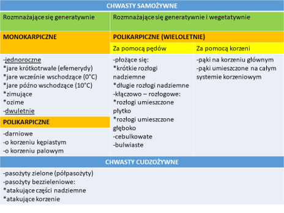

dr. inż. Elżbieta Pytlarz

# Wykład

test abcd, jednokrotnego wyboru, bez ujemnych pkt.

## Ochrona roślin przed chwastami

Herbologia - nauka biologii, ekologii, i zwalczaniu chwastów; stanowi jeden z działów ochrony roślin.

Agrofagi (straty wg Oerke):
  Herbologia: 34%
  Entomilogia: 18% (szkodniki)
  Fitopatologia 16% (bakterie, grzyby, wirusy)

ochrona roślin: najważniejszy przeciwko chwastom ok 2x

### Zagadnienia

- konkurencyjność chwastów w stosunku do roślin uprawnych
- szkodliwość chwastów
- kompensacja chwastów
- ustalanie progów szkodliwości zachwaszczenia
- ocena biologicznej skuteczności działania hericydów oraz ich mieszanek w zależności od przebiegu pogody, warunków glebowych i stopnia zachwaszczenia
- chemiczne, fizyczne, mechaniczne, biologiczne i agrotechniczne metody zwalczania chwastów
- badania wrażliwości odmianowej roślin uprawnych na herbicydy
- uodparnianie się chwastów na herbicydy
- ekologiczne skutki stosowania herbicydów
- działanie następcze herbicydów
- pozostałości herbicydów w środowisku i roślinie
- opracowanie metody intgrowanej (hybrydowej) zwalczania chwastów
- sporządzanie map fitosocjologicznych
- rejonizacja zachwaszczenia

### Rola chwastów w agroekosystemach

- negatywna
- pozytywna

zmiana podejścia na przestrzeni czasu: walka z chwastami -> zwalczanie chwastów -> regulacja zachwaszczenia

### Pozytywna rola chwastów w agroekosystemie

Siedlisko i źródło pokarmu dla pożytecznych organizmów (zapylacze).
Ochrona upraw przed szkodnikami:
- siedliwko bytowania owadów - antagonistów szkodników
- zwiększają różnorodność flory i fauny
- zwalczanie i odstraszanie szkodników upraw
- hamowanie rozwoju patogenów i chwastów (alleloherbicydy)
Funkcje międzyplnów:
- Ochrona gleby przed erozją
- Zatrzymywanie składników pokarmowych w górnej warstwie gleby
- "zielony nawóz"
- poprawa struktury gleby
produkcja kompostów

### Szkodliwość chwastów w agroekosystemie

Konkurencja z roślinami uprawnymi
pośrednictwo w przenoszeniu chorób i szkodników roślin uprawnych
obniżenie jakość i ilości plonu
utrudnienie zbioru i innych prac polowych
pasożytnictwo i półpasożytnictwo
właściwości trujące dla zwierząt i ludzi

wzrost chemizacji -> uodpornienie się chwastów na herbicydy -> wzrost kosztów produkcji

### Strategia "od polu do stołu"

Do 2030r. poszczególne państwa UE zrealizują następujące wymagania:
- ograniczenie o 50% zużycia śor
- ograniczenie 0 20% zużycia nawozów mineralnych

Usuwanie chwastów powinno być:
- skuteczne
- tanie
- przyjazne środowisku

---

# Ćwiczenia

2x rozpoznawanie 5/30 chwastów

## Podziały chwastów. Grupy biologiczne chwastów.

Chwast - Każda roślina lub roślinność (-grzyby) nieporządana z punktu widzenia człowieka

Roślina zachwaszczająca - roślina uprawna nie będąca naszym celem

### Podział ze względu na występowanie

Chwasty segetalne - rośliny synatropijne (dzikie), ujemnie wpływają na plon (ilość i jakość) - występują na polu
Chwasty ruderalne - zajmują miejsce nieuprawne (rowy melioracyjne, miedze, przydroża, ścieżki)
Chwasty użytków zielonych (łąk i pastwisk):
  Względne - rośliny dziko rosnące, które, jeśli występują w małej ilości, nie obniżają plonów roślin uprawnych, natomiast poprawiają smakowitość paszy
  Bezwzględne - wszystkie rośliny trujące występujące na użytkach zielonych lub podejrzane o właściwości trujące

### Podział ze względu na szkodliwość

Bardzo szkodliwe
- Pasożyty
- Półpasożytów
- Rośliny lub nasiona trujące
- Rośliny lub nasiona nadające produktom roślin uprawnych przyky, gorzki smak
- Krzyżyjące się z rośliną uprawną
- żywiciele chorób i szkodników roślin uprawnych

Szkodliwe
- Występujące masowo, zagłuszające i wypierające rośliny uprawne oraz roznażające się za pomocą nasion i części wegetatywnych.
- Chwasty żywotne (efemerydy) - krótki cykl rozwojowy
- Powodujące wyleganie (przechylenie rośliny) i utrudniające zbiór
- Chwasty, których nasiona są trudne do oddzielenia od nasion roślin uprawnych.

Mało szkodliwe
- Cała reszta

### Podział biologiczny

## Sposoby rozprzestrzeniania się chwastów

- Anemochoria (wiatr) "mniszek lekarski"
- Hydrohocia (wody) "rdest zmiemno-wodny"
- Zoochoria (zwierzęta)
  - endo
  - egzo
  - ornito
  - myrmekochoria (mrówki) "fiołek trójbarwny"
- Antropochoria "łopian większy"
- Autochoria "boliszek drobny, owies głuchy"

PL; Lat.; Owoc;

Bodziszek drobny _Geranium pusillum_ **GERPU** (skrót eppo)
Bodziszkowate _Geraniaceae_
Zimujący
Owłosiony
Liścienie ogonkowe
Kształt nerki
Char. liścienie mogą być przebarwione na anto-cyjanowy kolor, pierwsze liście są okrągłe, potem rosną do 7 klapy (później klapa dzieli się na 3 części)
Kwiaty fioletowe
Wzrost do 50cm wys.
Owoc: rozłupnia
Lubi gleby zasobne, powszechny na polach uprawnych, char. rozłupnia w kształcie świecznika
Roślina blastochoryczna
Kiedy wyrasta ponad łan, blokuje światło otwierając wektor ataku patogenów
Może pogarszać warunki fitosanitarne (łan nie jest przewiewny, wzrost wilgotności i temp. w łanie)

Iglica Pospolita _Erodium cicutarium_ **EROCI**
Bodziszkowate _Geraniaceae_
Zimujący
Liścienie ogonkowe, trójklapowe, trzy częściowe, środ. klapa jest największa, pierwsze liście są mnie rozbudowane, mnie powcinane, później coraz bardziej się wcinają.
Wzrost do 50cm.
Omszona
Owoc: rozłupnia
Kwiaty barwy, różowo-fioletowe.
Lubi gleby lekkie, piaszczyste, zachwaszcza okopowe, plus zboża (żyto, przenżyto), gatunek wskaźnikowy gleb lekkich.
Rozłupki "wkręcające się"

Fiołek Polny _Viola arvensis_ **VIOAR** (jasnota, przetacznik - podobne)
Fiołkowate _Violaceae_ (żeńskie imie w nazwie = owoc to torebka)
Owoc: torebka
Kwiat: Biało-żółty
Zimujący
Mermekochoria (elajosomy) - mrówki
Liścienie ogonkowe, jajowate
Siweka naga, nieowłosiona
Z wyglądu nawodniona, mięsista
Pierwsze liścienie jajowate. Brzegi mają karby. Im starsze tym więcej karbów.
Występuje w uprawach ozimych, zboża, rzepak. Próg szkodliwości 25 sztuk na m^2.
Wysokość do 20-30cm, kiedy wystepuje w rzepaku wzrost 1.5m. Może pogarszać warunki fitosanitarne (łan nie jest przewiewny, wzrost wilgotności i temp. w łanie)

Gorczyca Polna _Sinapis arvensis_ **SINAR** (rzodkiew świrzepa - podobne)
Kapustowate _Brassicaceae_
Owoc: łuszczyna
Jary, wcześnie wschodzący
Liścienie sercowate, ogonowe, siewka owłosiona, kształt blaszki liściowej wydłużone, stożkowate, "jakby coś wygryzało roślinę uprawną". Char. Wcięcia nigdy nie dojdą do nerwu głównego, u rzodkwi - dojdą. Wysokość do 1m. Występuje w zasiewach jarych, w warzywach. Lubi gleby zasobne w składniki pokarmowe. Gatunek trujący (glukozynolany, zostają po wysuszeniu rośliny). Kwitnie na żółto. Pośredniczy w przenoszeniu chorób na inne kapustowate.

Rzodkiew Świrzepa _Raphanus raphanistrum_ **RAPRA** (gorczyca polna - podobna)
Kapustowate _Brassicaceae_
Owoc: łuszczyna
Jary, wcześnie wschodzący
Liścienie sercowe, okonkowe, w zarysie blaszka stożkowata, wcięcia dochodzące do nerwu głównego, liscie towrzą rozetę liściową. Owłoziona, szorstka, szczeciniasta. Roślina zależna od PH, kwitnie na biało (wyższe), żółte (niższe), roślina indykatorowa. Zachwaszcza uprawy jare, okopowe, występuje w warzywach. Pośredniczy w przenoszeniu chorób na inne kapustowate.

Jasnota Różowa _Lamium amplexicaule_ **LAMAM** (podobne do fiołka)
Jasnowate _Lamiaceae_
Owoc: Rozłupnia
Gat.: Zimujący
Owłosiona, Łodyga czterokańciasta, dymorfizm liści (dolne ogonkowe, górne siedzące), kwiaty barwy różowej.
Liścienie mają lekkie wgłębienie na końcu. Pierwsze liście jajowate, owłosione, wyraźne unerwienie. Brzeg blaszki karbowany. Zachwaszcza większość upraw, nie występuje na ter. podmokłych.

Jasnota Puprpurowa _Lamium purpureum_ **LAMPU** (różni się od Jasnoty różowej głębokością wgłębienia - ma płytsze i brakiem dymorfizmu liści)
Jasnowate _Lamiaceae_
Owoc: Rozłupnia
Gat.: Zimujący
Owłosiona, Łodyga czterokańciasta, liście ogonkowe, kwiaty barwy różowej. Mogą być przebarwione na purpurowy, czerwony kolor.
Liścienie mają leciutkie wgłębienie na końcu. Pierwsze liście jajowate, owłosione, wyraźne unerwienie. Brzeg blaszki karbowany. Zachwaszcza większość upraw, nie występuje na ter. podmokłych. Lubi gleby żyzne, zasobne, zwłaszcza te nawożone obornikiem.

Poziewnik Szorstki _Galeopsis tetrahit_ **GAETE** (podobne do jasnot)
Jasnowate _Lamiaceae_ = Wargowe _Labiatea_
Owoc: Rozłupnia
Gat.: Jary wczesnie wschodzący
Char.: zgrubione węzły (kolanka) z których wyrastają kolejne łodygi. Roślina owłosiona, szorstka. Kwiaty różowe lub białe. Siewka omszona. Wyraźnie zaznaczone unerwienie. Liście ogonkowe. Brzegi ząbkowane. Zachwaszcza zboża jare i okopowe, lubi gleby zasobne. Ząbki przy ogonku czasem nie występują. Nasiona są trujące (zawierają kapsajcyne).

_Przetaczniki w kolejności pojawiania się na polu_

Przetacznik Bluszczykowy _Veronica hederofolia_ **VERHE**
Babkowate _Plantaginaceae_ / Trędownikowate _Scrophulariaceae_
Owoc: torebka
Gat.: Zimujące
Owłosiona. Liście przypominają liście bluszczu. Liście ogonkowate. Pierwsze liście są na początku trójkątne, później robią się klapy. Korzenie mogą pojawiać się na łodygach. Występuje wszędzie. Ma szeroką amplitudę występowania.

Przetacznik Polny _Veronica advensis_ **VERAR** (Fiołek - fiołek był nagi)
Babkowate _Plantaginaceae_
Owoc: torebka
Gat.: Zimujące
Kwiaty są niebieskie, Gat. owłosiony, płożący. Liścienie okrągłe. Pierwsze liście jajowate, brzegiem pojawiają się karby. Występuje wszędzie. Ma szeroką amplitudę występowania.

Przetacznik Perski _Veronica persica_ **VERPE**
Babkowate _Plantaginaceae_
Owoc: torebka
Gat.: Zimujące
Niebieskie kwiaty - jeden płatek ma białe przebarwienie. Liścienie są jajowato-trójkątne. Pierwsze liście są jajowate, brzegiem karbowate. Siewka owłosiona. Występuje wszędzie. Ma szeroką amplitudę występowania.

---

Rdest Plamisty _Polygonum persicaria_ **POLPE** (podobny do Rdest kolankowaty)
Rdestowate _Polygonaceae_
Owoc: orzeszek
Gat.: jary wcześnie wschodzący
Błonka (tutka) przy wyrastających liści, przylega do łodygi (char), liścienie (pierwsze liście) owalne/jajowate, krótki ogonek, łodyga czerwona/fioletowa, liście lancetowate, podłużne, dalsze liście mają brązową plamkę (char), ma brzegach i pod spodem mogą być drobne włoski, płożąca się, łodyga kolankowata, kwiaty mają barwę różową, skupione w walcowanym kłosie. Występuje w zbożach jarych i ozimych, rzepak ozimy, okopowe. Miejsca ruderalne. Gleby wilgotne, zasobne w azot. Brak określonych progów szkodliwości. Wektor mątwika burakowego, może powodować zatrucia u świń. Nasiona zachowują zdolność kiełkowania do 20lat. Nasiona nie trawią się w układzie pokarmowym.

Rdest powojowy _Fallopia convolvulus_ **FALCO** (podobny do powoju polnego)
Rdestowate _Polygonaceae_
Owoc: orzeszek trójgraniasty
Gat.: jary wcześnie wschodzący
Siewka, liścienie równowąskie, na szczycie tępo zakończone, łodyżka czerowa. Pierwszy liść trójkątne, kolejne sercowo-strzałkowate, owłosiona gadka pojawia się u nasady 3go liścia. Roślina wijąca się. Krótko owłosiona. Łodyga kansiasta, w dotyku szorstka. Oplata się na roślinach uprawnych, dobry, głęboki system korzeniowy. Kwiaty drobne, niepozorne, zielonkawe, zebrane w kątach liści. Gleby średnie, lekkie,nawet kwaśne. Zboża jare, okopowe, warzywniki. Chwast ruderalny. Nasiona kiełkują na drugi rok. Próg szkodliwości: kilkanaście sztuk na m^2. Powoduje wyleganie, utrudnia zbiór, dojrzewa razem ze zbożami, zanieczyszcza glebę i materiał siewny. Trująca w stanie zielonym. Rozpzsestrzenia się ornitochorycznie.

Rdest Ptasi _Polygonum aviculare_ **POLAV** ()
Rdestowate _Polygonaceae_
Owoc: orzeszek trójgraniasty
Gat.: jary wcześnie wschodzący
Liścienie wydłużone, równowąskie, cienkie, u nasady zrośnięte ze sobą, tworzy kształt litery V. Łodyszka czerwonawa. Nagie liście, lancetowate, krótkie ogonki, postrzępiona gadka. Łodyga głównie leżąca. Liście jednakowo eliptyczno-lancetowate, sino-zielony kolor. Kwiaty drobne, różowe, wewnątrz biało-zielone. Występują w kątach liści. Zachwaszcza zborza, częściej ozime, okopowe, ogrody, przeżedzone kończyny, ścierniska, miejsca ruderalne. Młoda roślina wykazuje właściwości lecznicze. Próg szkodliwości 16.5szt./m^2.

Starzec zwyczajny _Senecio vulgaris_ **SENVU** (podobny do mniszka lekarskiego)
Astrowate _Asteraceae_
Owoc: niełupka
Gat.: zimujący, zachowujący się jak efemeryda
Siewka ma liścienie podłużne, eliptyczne, tępo zakończone, grube. Pierwsze liście owalne, błyszczące, 2-4 ząbki. Łodyga prosta, wzniesiona. Liście piłkowane, krótki ogonek. Kolejne liście są siedzące. Kwiaty ryrkowate, zebrane w koszyczki, żółte. Występuje w uprawach warzywnych, ogrodach, okopowych, motylkowatych wieloletnich. Chwast ruderalny. Gleby próchniczne, zasobne w wode i azot. Trująca, zawiera alkaloidy. Kiełkuje cały sezon, daje kilka pokoleń.

Tasznik pospolity _Capsella bursa-pastoris_ **CAPBA** (podobny do Tobołka polnego)
Kapustowate _Brassicaceae_
Owoc: łuszczynka
Gat.: zimujący
Siewka z liścieniami drobnymi, eliptycznymi, krótkie ogonki. Pierwsze liście naprzeciwległe, eliptyczne, całobrzegie. Liście drugiej para są większe, faliste na brzegach, niekiedy pojedynczy ząbek. Dalsze liście głębiej powcinane. Liście bardzo zróżnicowane. Pojedyncze gwiazdkowate włoski (char.). Wielopostaciowy w zależności od gleby i pogody. Kwiaty białe, małe, zebrane w grona. Różne typy gleb, zborza jare i ozime, okopowe, ogrody. Chwast ruderalny. Brak określonych progów szkodliwości. Wektor rzepaku i innych kapustowatych. Roślina pionierska. Nasiona mogą wykiełkować po 30-40latach. Samo lub obcopylny w zależności od pogody. Wielopostaciowy morfologicznie.

Tobołek polny _Thlaspi arvense_ **THLAR**
Kapustowate _Brassicaceae_
Owoc: łuszczynka
Gat.: zimujący
Siewka o liścieniach okrągło-owalnych, krótkie ogonki, falowanie. Dalsze podłużnie owalne, eliptyczne, mają dłuższe ogonki. Siewka ma zapach czosnku. Prosta łodyga, nierozgałęziona. Liście zatokowo-ząbkowane. Pokolenie wiosenne nie wytwarza rozety. Kwiaty białe drobne, skupione w grono. Luszczynka prawie okrągła, szeroko oskrzydlona. Występuje w rzepaku, zborzach, okopowych, w ogrodach, na stanowiskach ruderalnych. Częściej występuje na zasobnych. Brak określonych progów szkodliwości. Nasiona zdolne do skiełokowania przed dojrzeniem rośliny. Osypują się przed zbiorem zbóż. Wektor rodziny kapustowatych. Roślina trująca. Nasiona w glebie przetrwają 10-20lat.

Wilczomlecz obrotny _Euphorbia helioscopia_ **EPHHE**
Wilczomleczowate _Euphorbiaceae_
Owoc: rozłupnia
Gat.: jary wcześnie wschodzący
Liścienie są owalne, na szczycie zaokrąglone, łodyszka jest czerwonawa. Liście odwrotnie jajowate, krótki ogonek. Do połowy całobrzegie, w dalszej części ząbkowane. Roślina wydziela sok mleczny. Liścienie i liście tworzą różyczkę. Łodyga prosta. Górne liście siedzące. Kwiaty niepozorne, żółtozielone. Słaby system korzeniowy. Występuje w ogrodach, okopowych, w warzywach, gleby dobrze nawożone. Roślina wskaźnikowa. Gleby raczej gliniaste i wilgotne. Trująca. żywiciel pośredni rdzy grochu.

Wiechlina roczna _Poa annua_ **POAAN**
Wiechlinowate **Poaceae**
Gat.: Efemeryda (jara krótkotrwała)
Siewka: blaszki i pochwy liściowe nagie, liści i liścienie równowąskie, ostro zakończone, poprzecznie marszczone, górna strona błyszcząca, pod spodem, matowo-błyszcząco, wyraźnie zaznaczony nerw główny, młode liście w pączku klapowato złożone. Dorosła od 10 do 30cm, krzaczasta, tworzy skupiska, płytki, rozbudowany system korzeniowy, liście gładkie, cienkie, wąski i średniodługi kołnierzykowaty tępy języczek, brak uszek. Kwiatosan: wiecha, kłoski zielone, czeronawo nabiegłe. Owoc - ziarniak oplewiony. Występowanie: ogrody, okopowe, rzepak ozimy, monokultury, miedze. Preferuje gleby wilgotne, próchniczne i żyzne. Progów szkodliwości brak. żywiciel zbóż i traw. Kiełkuje cały rok.

Rumianek pospolity _Matricaria chomomilla_ **MATCH**
Astrowate **Asteraceae**
gat.: Chwast zimujący
owoc: niełupka żeberkowana
Siewka ma drobne eliptyczne liścienie. Pierwsze liście z jedną/dwoma parami wąskich lancetowatych odcinków. Jeden jest wyżej drugi niżej. Odcinek szczytowy pierwszych liści jest dłógi i równowąski, całobrzegi (nie ma fal ani wcięć). Kolejne liście poj/podw. pierzastodzielne, cienkie, skąpo owłosione. Siewka po roztarciu pachnie rumiankiem. Dorosła od 15 do 40cm, naga, łodyga prosta lub rozgałęziona od nasady. Liście są 2-3 krotnie pierzastosieczne, kwiaty zebrane w wonny koszyczek o pustym dnie kwiatowym. Na zewnątrz płatki białe, w środku żółtawe rurkowate. Masowo zachwaszcza wiele upraw, głównie pojawia się w zborzach, okopowych, w warzywach, stanowiska ruderalne, gleby gliniaste, świeżych, żyznych, umiarkowanie kwaśnych. Nie ma okreslonych progów szkodliwości. Kiełkuje cały rok, wschody głównie na wiosne. Duża płodność, wydaje kilka tyś. nasion o różnej wielkości i zróżnicowanym okresie spoczynku.

Maruna bezwonna _Matricaria inodora_ **MATIN**
Astrowate **Asteraceae**
gat.: Chwast zimujący
owoc: niełupka żeberkowana
Siewka ma jajowate liścienie, dłuższe niż szersze, bardziej zaokrąglone i większe niż u rumianku. Liście pierwszej pary są pojedynczo pierzastosieczne z dwoma parami bocznych odcinków. Liście drugiej pary są podwójnie pierzastosieczne, odcinki leżą równolegle w stosunku do siebie (INACZEJ NIż RUMIANEK). Roztarta siewka nie pachnie rumiankiem. Dorosła od 20 do 100cm, łodyga rozgałęziona od połowy, bruzdkowana, cała roślina ma ciemno-zielony kolor. Koszyczki kwiatostanowe są pełne (o pełnym dnie). Kwiaty mają języczkowate płatki, żółte rurkowate. Zachwaszcza głównie zborza ozime, rzepak, kończynę i lucernę, rzadziej okopowe. Wyst. na podwórkach i przydrożach, gleby średnich i żyznych, niezbyt suche. Nie rośnie na glebach słabych. Brak progów szkodliwości. Bardzo płodna - 100tyś. nasion per roślina. Kiełkuje cały rok. Niełupki zachowują zdolność kiełkowania przez okres 6lat.

Rumian polny _Anthemis arvensis_ **ANTAR**
Astrowate **Asteraceae**
Gat.: Chwast zimujący
owoc: niełupka żeberkowana
Siewka ma liścienie drobne i eliptyczne, prawie siedzące. Liście pierwszej pary są pojedynczo pierzastosieczne, z dwiema parami lancetowatych bocznych odcinków. Na obu stronach są rzadko owłosione. Kolejne pary liście są podwójnie pierzastosieczne z lancetowatymi lub całobrzegowymi odcinkami. Dorosła do 50cm, rozgałęziona, rzadko i miękko owłosiona. Liście duże, mięsiste, podwójnie pierzastosieczne. Kwiaty pojedyncze zebrane w koszyczki, brzeżne są białe, środkowe są żółte i rurkowate. Dno kwiatowe pełne, wypukłe i stożkowate. Zachwaszcza zborza ozime i jarę, rzepak ozimy, okopowe. Występuje na ścierniskach, gleby ubogie, piaszczyste i kwaśne. Brak progów szkodliwości. Wytwarza kilka tyś. nasion.

Sporek polny _Spergula Arvensis_ **SPRAR**
Goździkowate Caryophyllaceae
Gat.: jary wcześnie wschodzący
Owoc: torebka
liścienie nitkowate, siedzące mięsiste, na szczycie tępe, na stronie górnej są wypukłe, a na dolnej wklęsłe. Skupione w nibyokółku. Dorosła ma 10-20cm wys. Łodyga wznosząca się, od dołu rozgałęziona. Dolne boczne pędy są na pół leżące. Liście wąskie nitkowate, mięsiste. Zebrane od 5 do 10 szt. w nibyokółku. Kwiaty białe i drobne, pięciodzielne na długich szypułkach. Torebka zawiera liczne drobne czarne nasiona. Występuje w zborzach jarych, ziemniakach, przeżedzonych uprawach, podoranych ścierniskach, gleby lekkie, piaszczyste, czasem bardzo słabe, kwaśne. Nie ma określonych progów szkodliwości. Nasiona zach. zdolność do kiełkowania wiele lat, nie trawią się.

Chaber bławatek _Centaurea cyanus_ **CENCY**
Astrowate **Asteraceae**
Gat.: chwast zimujący
owoc: niełupka
Liścienie jajowate, czasem na szczycie lekko płytko wcięte. Pierwsze liście wąskolancetowate. Na długich ogonkach, na brzegach są rzadko ząbkowane, obystronnie pokryte długimi filcowatymi włoskami. Na dole włosków jest więcej. Dalsze liście szarozielone, układają się w rozetę. Dorosła od 20-60cm, łodyga kanciasta, wzniesiona, od połowy rozgałęziona, dolne liście jajowato lancetowate, górne siedzące lancetowate i całobrzegie. Kwiaty niebiesko-fioletowe zebrane w poj. koszyczki. Brzeżne są lejkowate, wewnętrzne rurkowate. Występuje w zborzach ozimych, jarych i okopowych, gleby piaszczyste, gliniaste, ubogie w wapń. Prób szk. od 7-10szt./m^2. Zachwaszcza glebę i materiał siewny. Odporny na herbicydy. żywiciel nicieni atakujących zborza i kończyne. Roślina miododajna.

Dymnica pospolita _Fumaria officinalis_ **FUMOF**
Makowate **Papaveraceae**
Gat.: Chwast zimujący
Owoc: torebka
siewka ma długie i równowąskie liścienie, zaostrzone na końcu, barwy szarozielonej. Łodyżka jest sinoczerwona. Pierwsze liście są podwójnie trójsieczne, kolejne są wielokrotnie pierzastosieczne. Liście mają długie ogonki, pokryte sinym nalotem. Po roztarciu wydziela zapach spalonych liści. Dorosła do 30cm, również pokryta sino-zielonym nalotem, łodyga kanciasta, rozgałęziona, często leżąca. Liście podwójne pierzastosieczne. Kwiaty grzbieciste, purpurowe, czerwone. Występuje w okopowych, ogrodach, gleby żyzne i zasobne, optymalnie wilgotne. Próg szkodliwości 60szt./m^2. Kiełkuje w niskich temp. Utrudnione zwalczanie herbicydami. Powoduje zatrucia zwierząt.

Krzywoszyj (farbownik) polny _Anchusa arvensis_ **LYCAR**
Ogórecznikowate **Boraginaceae**
Gat.: chwast zimujący
Owoc: rozłupnia
Liścienie owalno-eliptyczno-lancetowate, szeroki, krótki ogonek, pokryte są szorstkim owłosieniem. Pierwsze liście podłużne lancetowate, długie faliste ogonki. Pokryte włoskami. Bardzo widoczny nerw główny. Dorosła 15-40cm. Cała kłująco owłosiona. Łodyga wzniesiona. Dolne liście lancetowate, całobrzegie. Łodygowe są siedzące. Kwiaty niebieskawe. Ozima występuje w zborzach ozimych, jara w okopowych, kukurydzy. Rośnie na glebach lekkich, średnich, kwaśne. Brak progów szkodliwości. Utrudnia zbiór. Zywiciel pośredni rdzy brunatnej żyta.

Mak Polny _Papaver rhoeas_ **PAPRH**
Makowate **Papaveraceae**
Gat.: chwast zimujący
Owoc: torebka
Liścienie nitkowate, lancetowate, ostre. Liście pierwszej pary owalne, ostre, całobrzegie. Dalsze liście coraz liczniejsze wcięcia, długie ogonki. Dolna strona sina, z nerwem. Pierwsze liście tworzą rozetę. Dorosła do 60cm. Po przecięciu wydziela sok mleczny. Łodyga wzniesiona, u dołu się rozgałęzia, owłosiona. Liście poj./podw. pierzastosieczne, pokryte włoskami. Kwiaty pojedyncze na długich szypułkach, czerwone, u nasady czarne. Występowanie w ozimych, okopowych, rzepak. Gleby wylgotne gliniaste. Próg 12-22szt./m^2. Trujący dla bydła, koni i świń.
