prof. Piotr Sobkowicz

Egzamin w sesji na 5sem

# Wykłady

## Specyfika polowej produkcji roślinnej

Rolnictwo - produkcja żywności, paszy, włókna naturalnego; dzięki roślinom i zwierzętom gosp.

Cele na XXIw.
- zwiększenie produkcji żywności
- produkcja roślin energetycznych
- godziwy dochód rolniczy
- ochrona środowiska

## Rodzaje Produkcje

Polowa produkcja roślinna na gruntach ornych
Produkcja pasz na łąkach i pastwiskach
Produkcja ogrodnicza
  sadownictwo
  warzywnictwo
  kwaicarstwo
Produkcja roślin leczniczych
Produkcja roślin wodnych w nat. i sztucznych zbiornikach
Produkcja leśna

## Specyfika

przenica, kukurydza - ziarniak (owoc)
burak cukrowy - korzeń spichrzowy
groch siewny (bobowate) - nasiono
len włóknisty - łodyga, nasiona
ziemniak - bulwa (przeksztańcowy pęd podziemny)
lucerna - liście, łodygi, kwiatostany
tytoń - liście
słonecznik - niełupka

odbywa się pod gołym niebem
cechuje się sezonowością
płodozmian
zmienna wysokość plonu
zienny koszt jednostkowy tego samego plonu
inne narzędzia przy innych warunkach

Rola - powierzchnia warstwa gleby na którą działają bezpośrednio narzędzia i maszyny uprawowe

Warstwa Orna (uprawna) - warstwa gleby podlegająca działaniu najgłębszych, systematycznie wykonywanych orek.
Na glebach o głębokim poziomie próchniczym ma zasięg do 35cm
Uprawa roli - całokształt czynności wykonywanych narzędziami i maszynami uprawowymi w celu stworzenia uprawianym roślinom optymalnych warunków wzrostu i rozwoju.
Uprawka (zabieg uprawowy) - każda czyność wykonywana narzędziem lub
Zabieg agrotechniczny
Następstwo roślin - uprawa na jednym polu w okresie kilku lat różnych lub jednakowych gatunków roślin, przy czym
(Właściwe, niewłaściwe)

Zmianowanie - następstwo roślin, które uwzględnia ich wymagania i warunki przyrodnicze siedliska oraz jest uzasadnione gospodarczo

Płodozmian - zmianowanie zaplanowane z góry na szereg lat

Rotacja - okres w ciągu którego jedna roślina przejdzie przez wszystkie pola płodozmianu lub wszystkie rośliny przejdą przez jedno pole.

Monokultura - uprawa jednego gatunku na tym samym polu w przez szerego lat.

Agroekosystem
- system - zbiór wzajemnie ze sobą poziąaznych elementów wyodrębnionych z otoczenia ze względu na te powiązania
  - Teoria systemów - opiera się na założeniu że podstawowe funkcje elementów danego systemu mogą być zrozumiane tylko patrząc z perspektywy tego systemu jako całości (von Bertalanffy 1968)
  - biosystem - system zawierający część ożywioną i nieożywioną
    - systemy naturalne
      - las naturalny
      - łąka naturalna
      - jezioro
    - systemy rolnicze (agroekosystemy)
      - gosp. rolnicze
    - system mmiejsko-przemysłowe (technoekosystemy)
      - miasto

| Cecha                         | Ekosystem naturalny | Agroekosystem               | System miejsko-przemysłowy |
| ----------------------------- | ------------------- | --------------------------- | -------------------------- |
| Obecność autotrofów           | tak                 | tak                         | nie                        |
| Gęstość zaludnienia           | brak                | mała                        | bardzo duża                |
| Rodzaj zużywanej energii      | słoneczna           | słoneczna i paliw kopalnych | paliw kopalnych            |
| ilość zużywanej energii / m^2 | bardzo mała         | mała                        | bardzo duża                |

Ekosystem - układ w którym organizmy żywe (biocenoza) w warunkach siedliska (biotopu) mogą żyć, rozwijać się, rozmnażać i uczestniczyć w przemianie materii, a przez nią korzysztać z przepływającej przez system energii.

Agroekosystem - różnie się od ekosystemu naturlanego tym że głównymi producentami biomasy są rośliny uprawianie przez człowieka a jej główna część stanowiąca produkt towarowy konsumowana jest poza danym obszarem
- gosp. rolnicze (zabudowa + pola)

zbiorowisko (biocenoza)
zbiorowisko pola uprawnego - argocenoza
- agrofitocenoza - zbiorowisko roślinne
- agrozoocenoza - zbiorowisko zwierzęce

Struktura troficzna
- substancje abiotyczne
- producenci
- konsumenci
- reducenci (mikrokonsumenci)

## Siedliska roślin uprawnych

Siedlisko - zespół natyralnych i sztucznych czynników zewnętrznych

Klimatyczne
- swiatlo
- temp.
- opady i osady
- powietrze i jego ruch

Glebowe
- właściwości fizyczne
- właściwości chemiczne
- właściwości biologiczne

Topograficzne
- wysokość n.p.m.
- rzeźba terenu
- skłony i wystawy

Biotyczne
- wpływ zwierząt
- wpływ roślin

Antropogeniczne

# Ćwiczenia

14-15.03 - Swojczyce - ocena przezimowania

## Podział roślin ze względu na trwałość

jednoroczne:
- jare (kukurydza)
- ozime (wyka kosmata)
- mające odmiany jare i ozime

dwuletnie (burak cukrowy):
- wegatywywne - pierwszy rok
- generatywne - drugi rok

- użytkowane w 1 i 2 roku

wieloletnie (wielokośne rośliny pastewne):
- lucerna

## Podział na grupy użytkowe

- zboża
- okopowe
- bobowate grubonasienne (dawniej strączkowe)
- bobowate drobnonasienne (motylkowe)
- przemysłowe
- pastewne 1-roczne (słonecznik)

## Nasionoznawstwo - nazionoznawstwo rolnicze

### Rozpoznanie

#### Zbożowe

##### Gatunki

| Gatunek + _**lat.**_                          | Rodzina + _**lat.**_             | Grupa użytkowa | Owoc                     | Materiał siewny          | Ter. siewu                 | Ter. zbioru               | Komp. glebowy         |
| --------------------------------------------- | -------------------------------- | -------------- | ------------------------ | ------------------------ | -------------------------- | ------------------------- | --------------------- |
| Przenica zwyczajna _**Triticum aestivum**_ | Trawy _**Poaceae**_           | Zbożowe        | ziarniak nieoplewiony | ziarniak nieoplewiony | 3/IX-2/X (o)  3/III (j) | 3/VII (o)  2/VIII (j)  | 1,2,3,4               |
| Żyto zwyczajne _**Secale cereale**_        | Trawy _**Poaceae**_           | Zbożowe        | ziarniak nieoplewiony | ziarniak nieoplewiony | 3/XI-2/XII (o)             | 3/VII (o)                 | 4,5,6                 |
| Przenżyto _**Triticosecale**_              | Trawy _**Poaceae**_           | Zbożowe        | ziarniak nieoplewiony | ziarniak nieoplewiony | 2-3/IX (o)  2-3/III (j) | 3/VII (o)  2-3/VIII(j) | 2,4.5                 |
| Jęczmień uprawny _**Hordeum sativum**_     | Trawy _**Poaceae**_           | Zbożowe        | ziarniak oplewiony    | ziarniak oplewiony    | 1/IX (o) 3/III (j)      | 1/VII (o)  1/VIII (j)  | 4,5 (o)  1,2,4 (j) |
| Owies siewny _**Avena sativa**_            | Trawy _**Poaceae**_           | Zbożowe        | ziarniak oplewiony    | ziarniak oplewiony    | 2/III                      | 2/VIII                    | 4,5,8,9               |
| Kukurydza _**Zea mays**_                   | Trawy _**Poaceae**_           | Zbożowe        | ziarniak nagi         | ziarniak nagi         | 3/IV                       | 1-2/X                     | 1,2,4,5               |
| Proso zwyczajne _**Panicum miliaceum**_    | Trawy _**Poaceae**_           | Zbożowe        | ziarniak oplewiony    | ziarniak oplewiony    | 1/V                        | 1-2/IX                    | 5                     |
| Gryka siewna _**Fagopyrum esculentum**_    | Rdestowate _**Polygonaceae**_ | Zbożowe        | orzeszek                 | orzeszek                 | 2/V                        | 3/VIII                    | 5,6                   |

##### Zdjęcia

| Gatunek                                       | Zdjęcie #1                                                   | zdjęcie #2                                                   | zdjęcie #3                                                   | zdjęcie #4                                                   |
| --------------------------------------------- | ------------------------------------------------------------ | ------------------------------------------------------------ | ------------------------------------------------------------ | ------------------------------------------------------------ |
| Przenica zwyczajna _**Triticum aestivum**_ | 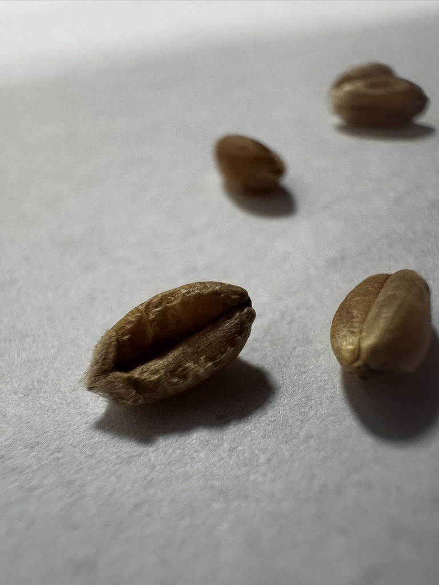   | 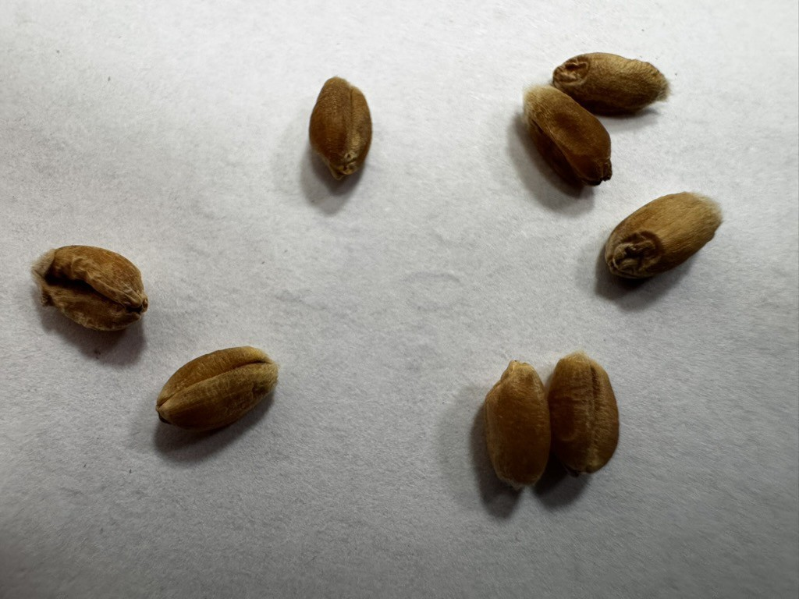   |    |    |
| Żyto zwyczajne _**Secale cereale**_        |            |            |            |            |
| Przenżyto _**Triticosecale**_              |  |  |  |  |
| Jęczmień uprawny _**Hordeum sativum**_     |    |    |    |    |
| Owies siewny _**Avena sativa**_            |          |          |          |          |
| Kukurydza _**Zea mays**_                   |  |  | 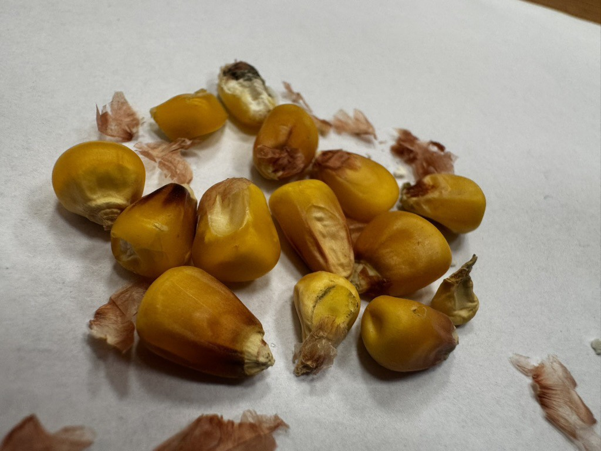 |  |
| Proso zwyczajne _**Panicum miliaceum**_    |          |          |          |          |
| Gryka siewna _**Fagopyrum esculentum**_    |          |          |          |          |

##### Opis

| Gatunek                                       | Kształt       | Kolor               | Powierzchnia | Cechy charakterystyczne                             |
| --------------------------------------------- | ------------- | ------------------- | ------------ | --------------------------------------------------- |
| Przenica zwyczajna _**Triticum aestivum**_ | baryłkowaty   | żółta               | gładka       | Brózdka, brudka i zarodek                           |
| Żyto zwyczajne _**Secale cereale**_        | wydłużony     | zielono-szaro-żółty | gładka       | Fioletowe kiedy wschodzi, Brózdka, brudka i zarodek |
| Przenżyto _**Triticosecale**_              | wydłużony     | żółta               | gładka       | Brózdka, brudka i zarodek                           |
| Jęczmień uprawny _**Hordeum sativum**_     | eliptyczny    | żółta               | gładka       | Posiada plewki                                      |
| Owies siewny _**Avena sativa**_            | łudeczkowaty  | żółta               | gładka       | -                                                   |
| Kukurydza _**Zea mays**_                   | eliptyczny    | żółta               | gładka       | -                                                   |
| Proso zwyczajne _**Panicum miliaceum**_    | eliptyczny    | żółta               | gładka       | -                                                   |
| Gryka siewna _**Fagopyrum esculentum**_    | trójgraniasty | brązowy-szara       | gładka       | -                                                   |

#### Bobowate grubonasienne (strączkowe)

##### Gatunki

| Gatunek + _**lat.**_                                    | Rodzina + _**lat.**_       | Grupa użytkowa         | Owoc  | Materiał siewny | Ter. siewu | Ter. zbioru | Komp. glebowy |
| ------------------------------------------------------- | -------------------------- | ---------------------- | ----- | --------------- | ---------- | ----------- | ------------- |
| Łubin żółty _**Lupius luteus**_                      | Bobowate _**Fabaceae**_ | Bobowate grubonasienne | Strąk | Nasiono         | 3/III-1/IV | 3/VIII      | 6,7           |
| Łubin wąskolistny _**Lupinus angustifolis**_         | Bobowate _**Fabaceae**_ | Bobowate grubonasienne | Strąk | Nasiono         | 3/III-1/IV | 2/VIII      | 4,5           |
| Łubin biały _**Lupinus albus**_                      | Bobowate _**Fabaceae**_ | Bobowate grubonasienne | Strąk | Nasiono         | 3/III-1/IV | 1/IX        | 2,3           |
| Groch siewny (jadalny) _**Pisum sativum**_           | Bobowate _**Fabaceae**_ | Bobowate grubonasienne | Strąk | Nasiono         | 3/III-1/IV | 3/VII       | 1,2,4         |
| Groch polny (pastewny, peluszka) _**Pisum sativum**_ | Bobowate _**Fabaceae**_ | Bobowate grubonasienne | Strąk | Nasiono         | 3/III-1/IV | 3/VII       | 4,5           |
| Bobik _**Vicia faba minor**_                         | Bobowate _**Fabaceae**_ | Bobowate grubonasienne | Strąk | Nasiono         | 3/III-1/IV | 2/IX        | 1,2,4         |
| Wyka kosmata (ozima) _**Vicia villosa**_              | Bobowate _**Fabaceae**_ | Bobowate grubonasienne | Strąk | Nasiono         | 3/VIII     | 3/VII       | 5,6           |
| Wyka siewna (jara) _**Vicia sativa**_                 | Bobowate _**Fabaceae**_ | Bobowate grubonasienne | Strąk | Nasiono         | 3/III-1/IV | 2/VIII      | 2,4           |
| Soja _**Glicine hispida**_                           | Bobowate _**Fabaceae**_ | Bobowate grubonasienne | Strąk | Nasiono         | 3/IV-1/V   | 1-2/IX      | 1,2           |
| Soczewica _**Lens esculenta**_                       | Bobowate _**Fabaceae**_ | Bobowate grubonasienne | Strąk | Nasiono         | 3/IV-1/V   | 1-2/IX      | 1,2           |

###### Zdjęcia

| Gatunek                                         | Zdjęcie #1                                                                   | Zdjęcie #2                                                                   | Zdjęcie #3                                                                   | Zdjęcie #4                                                                   |
| ----------------------------------------------- | ---------------------------------------------------------------------------- | ---------------------------------------------------------------------------- | ---------------------------------------------------------------------------- | ---------------------------------------------------------------------------- |
| Łubin żółty _**Lupius luteus**_              |              |              |              |              |
| Łubin wąskolistny _**Lupinus angustifolis**_ |  |  |  |  |
| Łubin biały _**Lupinus albus**_              |              |              |              |              |
| Groch siewny (jadalny) _**Pisum sativum**_   |            |            |            |            |
| Groch polny (pastewny) _**Pisum sativum**_   | 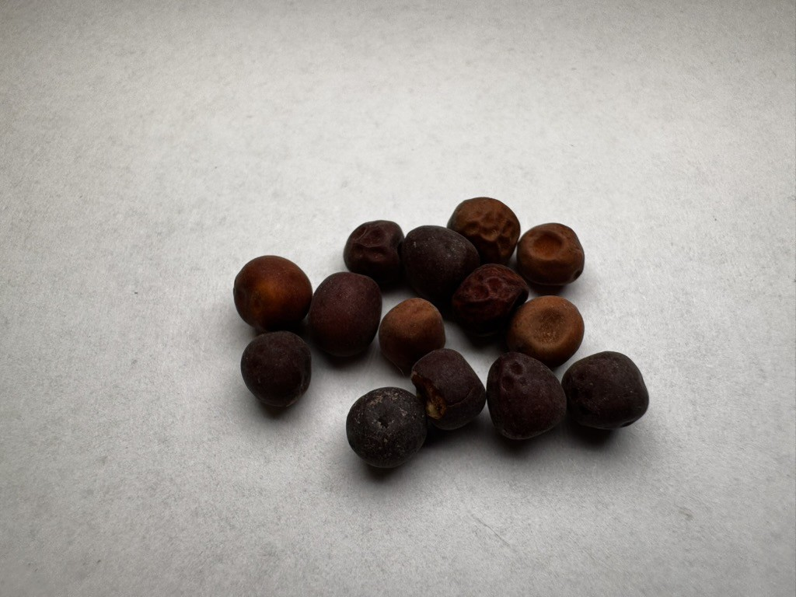             |              |              |              |
| Bobik _**Vicia faba minor**_                 |                          |                          |                          |                          |
| Wyka kosmata (ozima) _**Vicia villosa**_     |            |            |            |            |
| Wyka siewna (jara) _**Vicia sativa**_        |              |              |              | 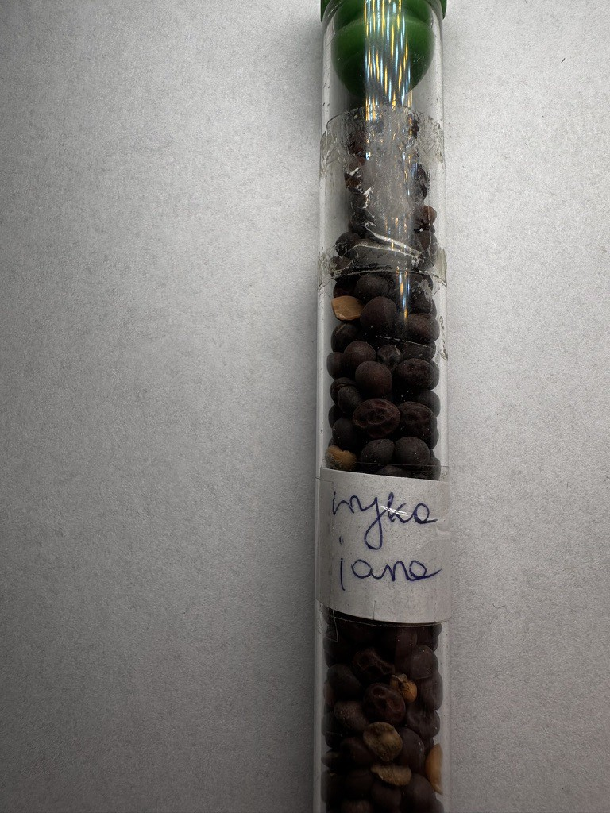             |
| Soja _**Glicine hispida**_                   |                            |                            | 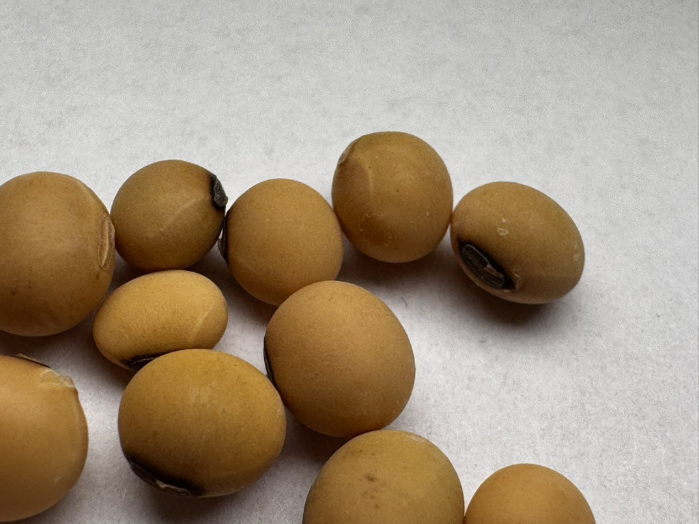                           |                            |
| Soczewica _**Lens esculenta**_               | 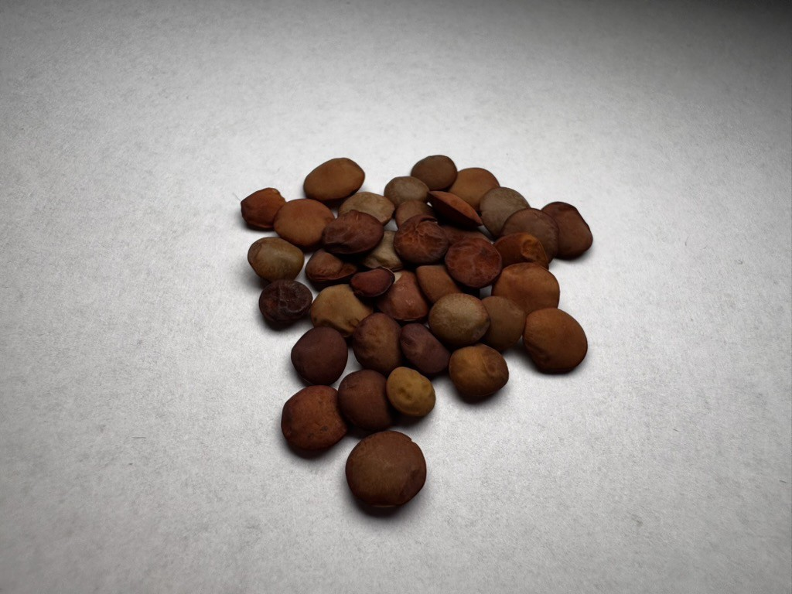                 |                  | 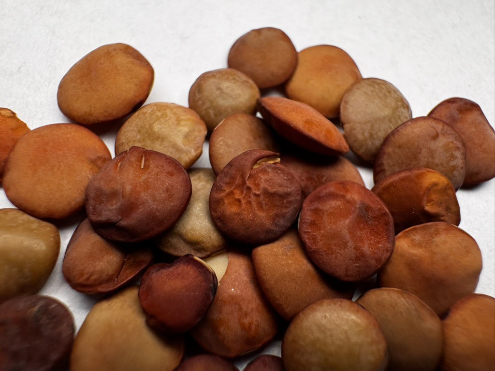                 |                  |

##### Opis

| Gatunek                                         | Kształt           | Kolor                    | Powierzchnia | Cechy charakterystyczne     |
| ----------------------------------------------- | ----------------- | ------------------------ | ------------ | --------------------------- |
| Łubin żółty _**Lupius luteus**_              | owalny            | nakrapiana,              | gładka       | niezakropokowany półksiężyc |
| Łubin wąskolistny _**Lupinus angustifolis**_ | nerkowaty         | szara                    | gładka       | strzałka i ciemna kreska    |
| Łubin biały _**Lupinus albus**_              | owalny            | kremowo-biała            | gładka       | centralne wgłębienie        |
| Groch siewny _**Pisum sativum**_             | kólisty           | biała                    | gładka       | ze znaczkiem                |
| Groch polny _**Pisum sativum**_              | kólisty           | brązowa                  | gładka       | ze znaczkiem                |
| Bobik _**Vicia faba minor**_                 | owalny            | brązowa                  | gładka       | -                           |
| Wyka kosmata _**Vicia villosa**_             | kólisty           | czarna                   | gładka       | toczą się                   |
| Wyka siewna _**Vicia sativa**_               | kólisty           | brunatna, ciemno-brązowa | gładka       | bujają się                  |
| Soja _**Glicine hispida**_                   | eliptyczno-owalny | żółta                    | gładka       | czasem z wyraźnym znaczkiem |
| Soczewica _**Lens esculenta**_               | dysk              | czerwono-brązowa         | gładka       | -                           |

#### Bobowate drobnonasienne

##### Gatunki

| Gatunek + _**lat.**_                                            | Rodzina + _**lat.**_       | Grupa użytkowa          | Owoc  | Materiał siewny       | Ter. siewu   | Ter. zbioru | Komp. glebowy |
| --------------------------------------------------------------- | -------------------------- | ----------------------- | ----- | --------------------- | ------------ | ----------- | ------------- |
| Lucerna mieszańcowa _**Medicago media**_                     | Bobowate _**Fabaceae**_ | Bobowate drobnonasienne | Strąk | Nasiono               | 2/IV         | 3-4 pokosy  | 2,3,4,5       |
| Koniczyna czerwona _**Trifolium pratense**_                  | Bobowate _**Fabaceae**_ | Bobowate drobnonasienne | Strąk | Nasiono               | 3/III-1/IV   | 2-3 pokosy  | 1,2,4,8       |
| Koniczyna biała _**Trifolium repens**_                       | Bobowate _**Fabaceae**_ | Bobowate drobnonasienne | Strąk | Nasiono               | 3/III-1/IV   | 2-3 pokosy  | 4,5           |
| Koniczyna białoróżowa (szwedzka) _**Trifolium hybridum**_    | Bobowate _**Fabaceae**_ | Bobowate drobnonasienne | Strąk | Nasiono               | 3/III-1/IV   | 1-2 pokosy  | 8             |
| Koniczyna szkarłatna (inkarnatka) _**Trifolium incarnatum**_ | Bobowate _**Fabaceae**_ | Bobowate drobnonasienne | Strąk | Nasiono               | 3/VII-1/VIII | 1 pokos     | 4,5           |
| Koniczyna perska _**Trifolium resupinatum**_                 | Bobowate _**Fabaceae**_ | Bobowate drobnonasienne | Strąk | Nasiono               | 1-2/IV       | 4 pokosy    | 4,10          |
| Esparceta (siewna) _**Onobrychis viciaefolia**_              | Bobowate _**Fabaceae**_ | Bobowate drobnonasienne | Strąk | Strąk (jednonasienny) | 3/IV-1/V     | 1-2 pokosy  | 4,5           |
| Nostrzyk (biały) _**Melilotus albus**_                       | Bobowate _**Fabaceae**_ | Bobowate drobnonasienne | Strąk | Nasiono               | 2/III        | 2 pokosy    | 6,7           |
| Seradela (siewna) _**Ornithopus sativus**_                   | Bobowate _**Fabaceae**_ | Bobowate drobnonasienne | Strąk | Człon strąka          | 3/III-1/IV   | 1/X         | 5,6,7         |
| Komonica zwyczajna _**Lotus corniculatus**_                  | Bobowate _**Fabaceae**_ | Bobowate drobnonasienne | Strąk | Nasiono               | 2/IV         | 2 pokosy    | 5,6           |

##### Zdjęcia

| Gatunek                                                         | Zdjęcie #1                                                                           | Zdjęcie #2                                                                           | Zdjęcie #3                                                                           | Zdjęcie #4                                                                           |
| --------------------------------------------------------------- | ------------------------------------------------------------------------------------ | ------------------------------------------------------------------------------------ | ------------------------------------------------------------------------------------ | ------------------------------------------------------------------------------------ |
| Lucerna mieszańcowa _**Medicago media**_                     |      |      |      |      |
| Koniczyna czerwona _**Trifolium pratense**_                  |        |        |        |        |
| Koniczyna biała _**Trifolium repens**_                       |              |              |              |              |
| Koniczyna białoróżowa (szwedzka) _**Trifolium hybridum**_    |  | 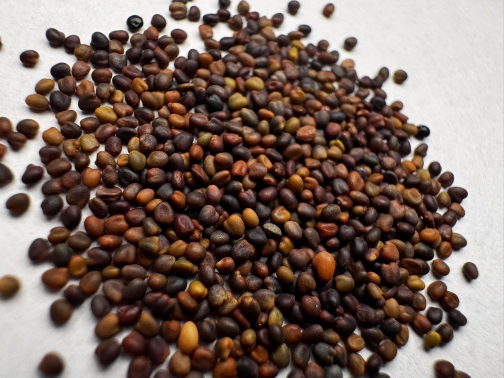 |  |  |
| Koniczyna szkarłatna (inkarnatka) _**Trifolium incarnatum**_ |    |    |    |    |
| Koniczyna perska _**Trifolium resupinatum**_                 |            |            |            |            |
| Esparceta (siewna) _**Onobrychis viciaefolia**_              |            |            |            |            |
| Nostrzyk (biały) _**Melilotus albus**_                       | 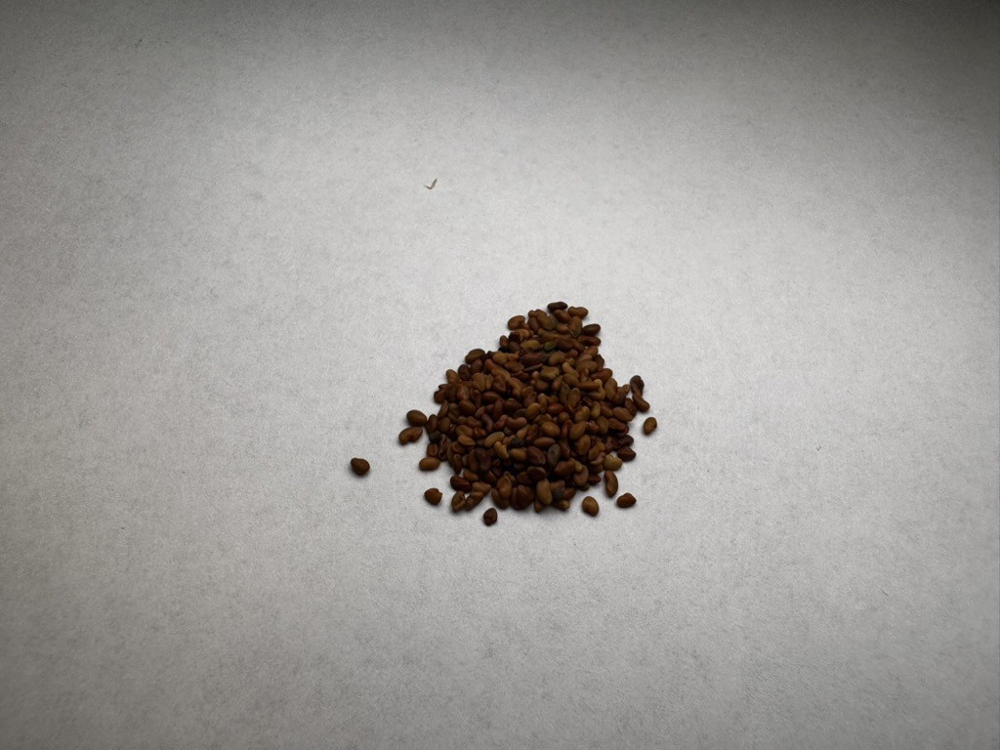               |                |                |                |
| Seradela (siewna) _**Ornithopus sativus**_                   |              |              |              | 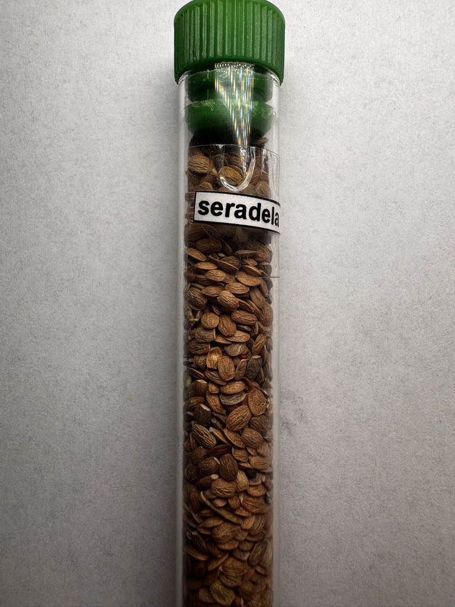             |
| Komonica zwyczajna _**Lotus corniculatus**_                  |        |        |        |        |

##### Opis

| Gatunek                                                         | Kształt                           | Kolor                   | Powierzchnia | Cechy charakterystyczne                   |
| --------------------------------------------------------------- | --------------------------------- | ----------------------- | ------------ | ----------------------------------------- |
| Lucerna mieszańcowa _**Medicago media**_                     | nerkowaty                         | brązowa                 | gładka       | -                                         |
| Koniczyna czerwona _**Trifolium pratense**_                  | rękawiczka z jednym palcem        | żółto-fioletowo-brązowa | gładka       | -                                         |
| Koniczyna biała _**Trifolium repens**_                       | sercowaty                         | żółto-brązowa           | gładka       | -                                         |
| Koniczyna białoróżowa (szwedzka) _**Trifolium hybridum**_    | sercowaty                         | granatowo-brązowa       | gładka       | -                                         |
| Koniczyna szkarłatna (inkarnatka) _**Trifolium incarnatum**_ | jajowaty                          | jasno-brązowe           | gładka       | -                                         |
| Koniczyna perska _**Trifolium resupinatum**_                 | owalny                            | brązowo-zielona         | gładka       | nie ma typowej rękawiczki z jednym palcem |
| Esparceta (siewna) _**Onobrychis viciaefolia**_              | pieroga                           | szara                   | gładka       | -                                         |
| Nostrzyk (biały) _**Melilotus albus**_                       | przeważa rękawica z jednym palcem | żółto-brązowa           | gładka       | -                                         |
| Seradela (siewna) _**Ornithopus sativus**_                   | prostokątny spłaszczony           | szara                   | gładka       | -                                         |
| Komonica zwyczajna _**Lotus corniculatus**_                  | owalny                            | brunatne                | gładka       | -                                         |

#### Przemysłowe

##### Gatunki

| Gatunek + _**lat.**_                                      | Rodzina + _**lat.**_              | Grupa użytkowa | Owoc      | Materiał siewny | Ter. siewu | Ter. zbioru  | Komp. glebowy |
| --------------------------------------------------------- | --------------------------------- | -------------- | --------- | --------------- | ---------- | ------------ | ------------- |
| Len zwyczajny _**Linum Usitatissimum**_                | Lnowate _**Linaceae**_         | Przemysłowe    | Torebka   | Nasiono         | 1-2/IV     | 3/VII-1/VIII | 2,4           |
| Konopie siewne _**Cannabis sativa**_                   | Konopiowate _**Cannabaceae**_  | Przemysłowe    | Orzeszek  | Orzeszek        | 3/IV-1/V   | 3/VIII-1/IX  | 2,4           |
| Rzepak ozimy _**Brassica napus var. oleifera**_        | Kapustowate _**Brassicaceae**_ | Przemysłowe    | Łuszczyna | Nasiono         | 3/VIII     | 1/VII        | 1,2,4,5       |
| Gorczyca biała _**Sinapis alba**_ (mylone z prosem)    | Kapustowate _**Brassicaceae**_ | Przemysłowe    | Łuszczyna | Nasiono         | 3/III-1/IV | 2-3/VII      | 4,5           |
| Słonecznik zwyczajny (oleisty) _**Helianthus annuus**_ | Astrowate _**Asteraceae**_     | Przemysłowe    | Niełupka  | Niełupka        | 3/IV       | 3/VIII       | 3,4,5         |
| Mak lekarski _**Papaver somniferum**_                  | Makowate _**Papaveraceae**_    | Przemysłowe    | Torebka   | Nasiono         | 3/III-1/IV | 3/VIII       | 4,5           |
| Tytoń szlachetny _**Nicotiana tabacum**_               | Psiankowate _**Solanaceae**_   | Przemysłowe    | Torebka   | Nasiono         | 1/V        | 3/VII-IX     | 4,5           |

##### Zdjęcia

| Gatunek                                                   | Zdjęcie #1                                                                         | Zdjęcie #2                                                                         | Zdjęcie #3                                                                         | Zdjęcie #4                                                                         |
| --------------------------------------------------------- | ---------------------------------------------------------------------------------- | ---------------------------------------------------------------------------------- | ---------------------------------------------------------------------------------- | ---------------------------------------------------------------------------------- |
| Len zwyczajny _**Linum Usitatissimum**_                |                |                |                |                |
| Konopie siewne _**Cannabis sativa**_                   |              |              |              |              |
| Rzepak ozimy _**Brassica napus var. oleifera**_        |                  |                  |                  |                  |
| Gorczyca biała _**Sinapis alba**_ (mylone z prosem)    |              |              |              |              |
| Słonecznik zwyczajny (oleisty) _**Helianthus annuus**_ |  |  |  |  |
| Mak lekarski _**Papaver somniferum**_                  |                  |                  |                  |                  |
| Tytoń szlachetny _**Nicotiana tabacum**_               |          |          |          |          |

##### Opis

| Gatunek                                                   | Kształt      | Kolor           | Powierzchnia | Cechy charakterystyczne |
| --------------------------------------------------------- | ------------ | --------------- | ------------ | ----------------------- |
| Len zwyczajny _**Linum Usitatissimum**_                | łezki        | brązowa         | gładka       | -                       |
| Konopie siewne _**Cannabis sativa**_                   | owalny       | szara           | gładka       | rysunek                 |
| Rzepak ozimy _**Brassica napus var. oleifera**_        | kulisty      | czarno-brunatna | gładka       | -                       |
| Gorczyca biała _**Sinapis alba**_                      | kulisty      | żółta           | gładka       | mylone z prosem         |
| Słonecznik zwyczajny (oleisty) _**Helianthus annuus**_ | klinowaty    | czarny          | gładka       | -                       |
| Mak lekarski _**Papaver somniferum**_                  | nerkowaty    | szaro-niebieska | urzeźbiona   | -                       |
| Tytoń szlachetny _**Nicotiana tabacum**_               | nieregularny | brązowa         | nieregularna | -                       |

#### Okopowe

##### Gatunki

| Gatunek + _**lat.**_                                               | Rodzina + _**lat.**_               | Grupa użytkowa | Owoc      | Materiał siewny | Ter. siewu   | Ter. zbioru | Komp. glebowy |
| ------------------------------------------------------------------ | ---------------------------------- | -------------- | --------- | --------------- | ------------ | ----------- | ------------- |
| Ziemniak _**Solanum tuberosum**_                                | Psiankowate _**Solanaceae**_    | Okopowe        | N/a       | N/a             | 2-3/IV       | 3/VII-X     | 4,5,6         |
| Burak cukrowy _**Beta vulgaris ssp. vulragis var. altissima.**_ | Komosowate _**Chenopodiaceae**_ | Okopowe        | Torebka   | Kłębek          | 1-2/IV       | 1/X         | 1,2,4         |
| Marchew pastewna _**Daucus carota var. sativa**_                | Selerowate _**Apiaceae**_       | Okopowe        | Rozłupnia | Rozłupka        | 3/III-1/IV   | 2/X         | 4,5,9         |
| Cykoria korzeniowa _**Cichorium intybus ssp. sativus**_         | Astrowate _**Asteraceae**_      | Okopowe        | Niełupka  | Niełupka        | 1/V          | 2/X         | 4,5           |
| Brukiew _**Brassica napus var. rapifera**_                      | Kapustowate _**Brassicaceae**_  | Okopowe        | Łuszczyna | Nasiono         | 3/III        | 1-3/X       | 3,5,6         |
| Rzepa ścierniskowa _**Brassica rapa var. rapifera**_            | Kapustowate _**Brassicaceae**_  | Okopowe        | Łuszczyna | Nasiono         | 3/VII-1/VIII | 1/XI        | 5,9           |

##### Zdjęcia

| Gatunek                                                            | Zdjęcie #1                                                                     | Zdjęcie #2                                                                     | Zdjęcie #3                                                                     | Zdjęcie #4                                                                     |
| ------------------------------------------------------------------ | ------------------------------------------------------------------------------ | ------------------------------------------------------------------------------ | ------------------------------------------------------------------------------ | ------------------------------------------------------------------------------ |
| Ziemniak _**Solanum tuberosum**_                                | N/a                                                                            | N/a                                                                            | N/a                                                                            | N/a                                                                            |
| Burak cukrowy _**Beta vulgaris ssp. vulragis var. altissima.**_ |            |            |            |            |
| Marchew pastewna _**Daucus carota var. sativa**_                |      |      |      |      |
| Cykoria korzeniowa _**Cichorium intybus ssp. sativus**_         |  |  |  |  |
| Brukiew _**Brassica napus var. rapifera**_                      |                        |                        |                        |                        |
| Rzepa ścierniskowa _**Brassica rapa var. rapifera**_            |  |  |  |  |

##### Opis

| Gatunek                                                            | Kształt    | Kolor         | Powierzchnia | Cechy charakterystyczne |
| ------------------------------------------------------------------ | ---------- | ------------- | ------------ | ----------------------- |
| Ziemniak _**Solanum tuberosum**_                                | N/a        | N/a           | N/a          | -                       |
| Burak cukrowy _**Beta vulgaris ssp. vulragis var. altissima.**_ | kulisty    | jasno-brązowa | gładka       | -                       |
| Marchew pastewna _**Daucus carota var. sativa**_                | eliptyczny | brązowe       | 7 żeberkowa  | mylona z cykorią        |
| Cykoria korzeniowa _**Cichorium intybus ssp. sativus**_         | klinowaty  | jasno-brązowa | gładka       | -                       |
| Brukiew _**Brassica napus var. rapifera**_                      | kulisty    | szaro-czarny  | gładka       | -                       |
| Rzepa ścierniskowa _**Brassica rapa var. rapifera**_            | kulisty    | rudy          | gładka       | -                       |

#### Pastewne 1 roczne i międzyplony

##### Gatunki

| Gatunek + _**lat.**_                                      | Rodzina + _**lat.**_                 | Grupa użytkowa    | Owoc      | Materiał siewny | Ter. siewu                | Ter. zbioru    | Komp. glebowy |
| --------------------------------------------------------- | ------------------------------------ | ----------------- | --------- | --------------- | ------------------------- | -------------- | ------------- |
| Kapusta pastewna _**Brassica oleracea var. acephala**_ | Kapustowate _**Brassicaceae**_    | Pastewne 1 roczne | Łuszczyna | Nasiono         | 2/III                     | 2/VII i XI-XII | 1,2,4,8       |
| Facelia _**Phacelia tanacetifolia**_                   | Faceliowate _**Hydrophyllaceae**_ | Międzyplony       | Torebka   | Nasiono         | międzyplon ścierniskowy   |                | 5,6           |
| Rzodkiew oleista _**Raphanus sativus var. oleiferus**_ | Kapustowate _**Brassicaceae**_    | Międzyplony       | Łuszczyna | Nasiono         | międzyplon ścierniskowy   |                | 1,2,4,5       |

##### Zdjęcia

| Gatunek                                                   | Zdjęcie #1                                                                 | Zdjęcie #2                                                                 | Zdjęcie #3                                                                 | Zdjęcie #4                                                                 |
| --------------------------------------------------------- | -------------------------------------------------------------------------- | -------------------------------------------------------------------------- | -------------------------------------------------------------------------- | -------------------------------------------------------------------------- |
| Kapusta pastewna _**Brassica oleracea var. acephala**_ |  |  |  |  |
| Facelia _**Phacelia tanacetifolia**_                   |                    |                    |                    |                    |
| Rzodkiew oleista _**Raphanus sativus var. oleiferus**_ |  |  |  |  |

##### Opis

| Gatunek                                                   | Kształt      | Kolor         | Powierzchnia | Cechy charakterystyczne |
| --------------------------------------------------------- | ------------ | ------------- | ------------ | ----------------------- |
| Kapusta pastewna _**Brassica oleracea var. acephala**_ | kulisty      | szaro-czarny  | gładka       | -                       |
| Facelia _**Phacelia tanacetifolia**_                   | rożka        | brązowa       | urzeźbiona   | -                       |
| Rzodkiew oleista _**Raphanus sativus var. oleiferus**_ | nieregularny | jasno-brązowa | gładka       | -                       |

---

kapusta pastewna: mają niereg. kształt.
brukiew jest malutka
rzepa śc. ma rude nasiona

lucerna -
nostrzyk - pachnie kumaryną

## Ocena materiału siewnego

PIORIN + WIORIN (powiatowy / wojewódzki inspektorat ochrony roślin i nasiennictwa)
- nadzór nad produkcją mat. siewnego spełniającego wymagania zdrowotnościowe i jakościowe (min. ocena polowa i lab. materiału siewnego)

ISTA
- ustala procedury w zakresie pobierania prób i oceny materiału siewnego

OECD
- ujednolica zasady wytwarzania i jakości mat. siewnego w obrocie międzynarodowym

Państwo polskie
- działalność ustawodawcza - ustawy związane z nasiennictwem publikowane w Dzienniku Ustaw, np. Ustawa o nasiennictwie

### Stopień kwalifikacji

- Elitarny (kat.)
  - Przedbazowy (stopień); PB_III/PB_II (symbol); biała z fioletowym ukośnym paskiem (kolor etykiety)
  - Bazowy; B; biała)
- Kwalifikowany
  - Pierwszego rozmnożenia; C1; niebieska
  - Drugiego rozmnożenia; C2; czerwona
  - Trzeciego rozmnożenia; C3; czerwona

Rozmnażanie materiału siewnego o niskim wsp. rozmnożenia
mat. hodowlany -> PB_III -> PB_II -> B -> C1 -> C2 -> C3
_niski współczynnik rozmnożenia to np. wszystkie zboża z wyjątkiem gryki_

100kg -> 3t (pb3)
3x30 -> 90t (pb2)
90x30 -> 2700 (b)
2700x30 -> 81000 (c1)
81000/200 -> 405000ha

## Uprawki
