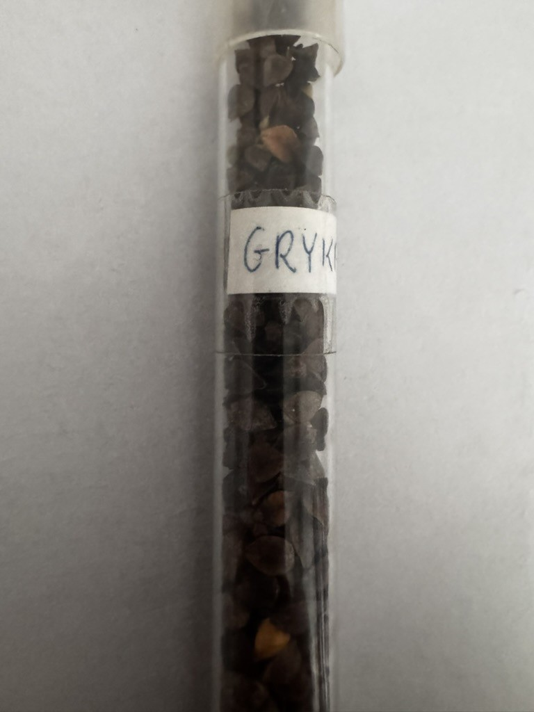

prof. Piotr Sobkowicz

Egzamin w sesji na 5sem

# Wykłady

## Specyfika polowej produkcji roślinnej

Rolnictwo - produkcja żywności, paszy, włókna naturalnego; dzięki roślinom i zwierzętom gosp.

Cele na XXIw.
- zwiększenie produkcji żywności
- produkcja roślin energetycznych
- godziwy dochód rolniczy
- ochrona środowiska

## Rodzaje Produkcje

Polowa produkcja roślinna na gruntach ornych
Produkcja pasz na łąkach i pastwiskach
Produkcja ogrodnicza
  sadownictwo
  warzywnictwo
  kwaicarstwo
Produkcja roślin leczniczych
Produkcja roślin wodnych w nat. i sztucznych zbiornikach
Produkcja leśna

## Specyfika

przenica, kukurydza - ziarniak (owoc)
burak cukrowy - korzeń spichrzowy
groch siewny (bobowate) - nasiono
len włóknisty - łodyga, nasiona
ziemniak - bulwa (przeksztańcowy pęd podziemny)
lucerna - liście, łodygi, kwiatostany
tytoń - liście
słonecznik - niełupka

odbywa się pod gołym niebem
cechuje się sezonowością
płodozmian
zmienna wysokość plonu
zienny koszt jednostkowy tego samego plonu
inne narzędzia przy innych warunkach

Rola - powierzchnia warstwa gleby na którą działają bezpośrednio narzędzia i maszyny uprawowe

Warstwa Orna (uprawna) - warstwa gleby podlegająca działaniu najgłębszych, systematycznie wykonywanych orek.
Na glebach o głębokim poziomie próchniczym ma zasięg do 35cm
Uprawa roli - całokształt czynności wykonywanych narzędziami i maszynami uprawowymi w celu stworzenia uprawianym roślinom optymalnych warunków wzrostu i rozwoju.
Uprawka (zabieg uprawowy) - każda czyność wykonywana narzędziem lub
Zabieg agrotechniczny
Następstwo roślin - uprawa na jednym polu w okresie kilku lat różnych lub jednakowych gatunków roślin, przy czym
(Właściwe, niewłaściwe)

Zmianowanie - następstwo roślin, któ®e uwzględnia ich wymagania i warunki przyrodnicze siedliska oraz jest uzasadnione gospodarczo

# Ćwiczenia

14-15.03 - Swojczyce - ocena przezimowania

## Podział roślin ze względu na trwałość

jednoroczne:
- jare (kukurydza)
- ozime (wyka kosmata)
- mające odmiany jare i ozime

dwuletnie (burak cukrowy):
- wegatywywne - pierwszy rok
- generatywne - drugi rok

- użytkowane w 1 i 2 roku

wieloletnie (wielokośne rośliny pastewne):
- lucerna

## Podział na grupy użytkowe

- zboża
- okopowe
- bobowate grubonasienne (dawniej strączkowe)
- bobowate drobnonasienne (motylkowe)
- przemysłowe
- pastewne 1-roczne (słonecznik)

## Nasionoznawstwo - nazionoznawstwo rolnicze

### Rozpoznanie

#### Zbożowe

Grupa roślin o mączystych nasionach użytkowych po przeiale (mąka, kasza, śruta, patki) lub bespośrednio skarmianych.

| Gatunek + _**lat.**_                          | Rodzina + _**lat.**_             | Grupa użytkowa | Owoc                     | Materiał siewny          | Ter. siewu                 | Ter. zbioru               | Komp. glebowy         |
| --------------------------------------------- | -------------------------------- | -------------- | ------------------------ | ------------------------ | -------------------------- | ------------------------- | --------------------- |
| Przenica zwyczajna _**Triticum aestivum**_ | Trawy _**Poaceae**_           | Zbożowe        | ziarniak nieoplewiony | ziarniak nieoplewiony | 3/IX-2/X (o)  3/III (j) | 3/VII (o)  2/VIII (j)  | 1,2,3,4               |
| Żyto zwyczajne _**Secale cereale**_        | Trawy _**Poaceae**_           | Zbożowe        | ziarniak nieoplewiony | ziarniak nieoplewiony | 3/XI-2/XII (o)             | 3/VII (o)                 | 4,5,6                 |
| Przenżyto _**Triticosecale**_              | Trawy _**Poaceae**_           | Zbożowe        | ziarniak nieoplewiony | ziarniak nieoplewiony | 2-3/IX (o)  2-3/III (j) | 3/VII (o)  2-3/VIII(j) | 2,4.5                 |
| Jęczmień uprawny _**Hordeum sativum**_     | Trawy _**Poaceae**_           | Zbożowe        | ziarniak oplewiony    | ziarniak oplewiony    | 1/IX (o) 3/III (j)      | 1/VII (o)  1/VIII (j)  | 4,5 (o)  1,2,4 (j) |
| Owies siewny _**Avena sativa**_            | Trawy _**Poaceae**_           | Zbożowe        | ziarniak oplewiony    | ziarniak oplewiony    | 2/III                      | 2/VIII                    | 4,5,8,9               |
| Kukurydza _**Zea mays**_                   | Trawy _**Poaceae**_           | Zbożowe        | ziarniak nagi         | ziarniak nagi         | 3/IV                       | 1-2/X                     | 1,2,4,5               |
| Proso zwyczajne _**Panicum miliaceum**_    | Trawy _**Poaceae**_           | Zbożowe        | ziarniak oplewiony    | ziarniak oplewiony    | 1/V                        | 1-2/IX                    | 5                     |
| Gryka siewna _**Fagopyrum esculentum**_    | Rdestowate _**Polygonaceae**_ | Zbożowe        | orzeszek                 | orzeszek                 | 2/V                        | 3/VIII                    | 5,6                   |

| Gatunek                                                                                                                                                                                 | Zdjęcie #1                                                   | zdjęcie #2                                                   | zdjęcie #3                                                   | zdjęcie #4                                                   |
| --------------------------------------------------------------------------------------------------------------------------------------------------------------------------------------- | ------------------------------------------------------------ | ------------------------------------------------------------ | ------------------------------------------------------------ | ------------------------------------------------------------ |
| Przenica zwyczajna _**Triticum aestivum**_  Kształt: baryłkowaty; Barwa: żółta; Powierzchnia: gładka; Char: Brózdka, brudka i zarodek;                                |    |    |    |    |
| Żyto zwyczajne _**Secale cereale**_  Kształt: wydłużony; Barwa: zielono-szaro-żółty; Powierzchnia: gładka; Char: Fioletowe kiedy wschodzi, Brózdka, brudka i zarodek; |            |            |            |            |
| Przenżyto _**Triticosecale**_  Kształt: wydłużony (po życie); Barwa: żółta (po przenicy); Powierzchnia: gładka / pomarszczona;                                           |  |  |  |  |
| Jęczmień uprawny _**Hordeum sativum**_  Kształt: eliptyczny; Barwa: żółta; Powierzchnia: gładka; Char: Posiada plewki;                                                |    |    |    |    |
| Owies siewny _**Avena sativa**_  Kształt: Łudeczkowaty; Barwa: żółta; Powierzchnia: gładka;                                                                              |          |          |          |          |
| Kukurydza _**Zea mays**_  Kształt: eliptyczny lub końskiego zęba; Barwa: żółta; Powierzchnia: gładka;                                                                    |  |  |  |  |
| Proso zwyczajne _**Panicum miliaceum**_  Kształt: eliptyczny; Barwa: żółta; Powierzchnia: gładka;                                                                        |          |          |          |          |
| Gryka siewna _**Fagopyrum esculentum**_  Kształt: trójgraniasty; Barwa: brązowy-szara; Powierzchnia: gładka;                                                             |          |          |          |          |

#### Bobowate grubonasienne (strączkowe)

| Gatunek + _**lat.**_ | Rodzina + _**lat.**_ | Grupa użytkowa         | Owoc | Materiał siewny | Ter. siewu | Ter. zbioru | Komp. glebowy |
| -------------------- | -------------------- | ---------------------- | ---- | --------------- | ---------- | ----------- | ------------- |
| Łubin żółty          | Strączkowe           | Bobowate grubonasienne |      |                 | 3/III-1/IV | 3/VIII      | 6,7           |
| Łubin wąskolistny    |                      | Bobowate grubonasienne |      |                 | 3/III-1/IV | 2/VIII      | 4,5           |
| Łubin biały          |                      | Bobowate grubonasienne |      |                 | 3/III-1/IV | 1/IX        | 2,3           |
| Groch siewny         |                      | Bobowate grubonasienne |      |                 | 3/III-1/IV | 3/VII       | 1,2,4         |
| Groch polny          |                      | Bobowate grubonasienne |      |                 | 3/III-1/IV | 3/VII       | 4,5           |
| Bobik                |                      | Bobowate grubonasienne |      |                 | 3/III-1/IV | 2/IX        | 1,2,4         |
| Wyka kosmata         |                      | Bobowate grubonasienne |      |                 | 3/VIII     | 3/VII       | 5,6           |
| Wyka siewna          |                      | Bobowate grubonasienne |      |                 | 3/III-1/IV | 2/VIII      | 2,4           |
| Soja                 |                      | Bobowate grubonasienne |      |                 | 3/IV-1/V   | 1-2/IX      | 1,2           |
| Soczewica            |                      | Bobowate grubonasienne |      |                 | 3/IV-1/V   | 1-2/IX      | 1,2           |

#### Bobowate drobnonasienne

| Gatunek + _**lat.**_  | Rodzina + _**lat.**_ | Grupa użytkowa          | Owoc | Materiał siewny | Ter. siewu   | Ter. zbioru | Komp. glebowy |
| --------------------- | -------------------- | ----------------------- | ---- | --------------- | ------------ | ----------- | ------------- |
| Lucerna siewna        |                      | Bobowate drobnonasienne |      |                 | 2/IV         | 3-4 pokosy  | 2,3,4,5       |
| Lucerna mieszańcowa   |                      | Bobowate drobnonasienne |      |                 | 2/IV         | 3-4 pokosy  | 2,3,4,5       |
| Lucerna chmielowa     |                      | Bobowate drobnonasienne |      |                 | 2-3/IV       | 1-2 pokosy  | 4,5           |
| Koniczyna czerwona    |                      | Bobowate drobnonasienne |      |                 | 3/III-1/IV   | 2-3 pokosy  | 1,2,4,8       |
| Koniczyna biała       |                      | Bobowate drobnonasienne |      |                 | 3/III-1/IV   | 2-3 pokosy  | 4,5           |
| Koniczyna białoróżowa |                      | Bobowate drobnonasienne |      |                 | 3/III-1/IV   | 1-2 pokosy  | 8             |
| Koniczyna szkarłatna  |                      | Bobowate drobnonasienne |      |                 | 3/VII-1/VIII | 1 pokos     | 4,5           |
| Koniczyna perska      |                      | Bobowate drobnonasienne |      |                 | 1-2/IV       | 4 pokosy    | 4,10          |
| Esparceta             |                      | Bobowate drobnonasienne |      |                 | 3/IV-1/V     | 1-2 pokosy  | 4,5           |
| Nostrzyk              |                      | Bobowate drobnonasienne |      |                 | 2/III        | 2 pokosy    | 6,7           |
| Seradela              |                      | Bobowate drobnonasienne |      |                 | 3/III-1/IV   | 1/X         | 5,6,7         |
| Komonica zwyczajna    |                      | Bobowate drobnonasienne |      |                 | 2/IV         | 2 pokosy    | 5,6           |

#### Przemysłowe

| Gatunek + _**lat.**_ | Rodzina + _**lat.**_ | Grupa użytkowa | Owoc | Materiał siewny | Ter. siewu | Ter. zbioru  | Komp. glebowy |
| -------------------- | -------------------- | -------------- | ---- | --------------- | ---------- | ------------ | ------------- |
| Len                  |                      | Przemysłowe    |      |                 | 1-2/IV     | 3/VII-1/VIII | 2,4           |
| Konopie              |                      | Przemysłowe    |      |                 | 3/IV-1/V   | 3/VIII-1/IX  | 2,4           |
| Rzepak ozimy         |                      | Przemysłowe    |      |                 | 3/VIII     | 1/VII        | 1,2,4,5       |
| Rzepik ozimy         |                      | Przemysłowe    |      |                 | 1/IX       | 1/VII        | 1,2,4,5       |
| Gorczyca biała       |                      | Przemysłowe    |      |                 | 3/III-1/IV | 2-3/VII      | 4,5           |
| Słonecznik oleisty   |                      | Przemysłowe    |      |                 | 3/IV       | 3/VIII       | 3,4,5         |
| Mak                  |                      | Przemysłowe    |      |                 | 3/III-1/IV | 3/VIII       | 4,5           |
| Dynia zwyczajna      |                      | Przemysłowe    |      |                 | 2/V        | 1/X          | 4,5           |
| Tytoń szlachetny     |                      | Przemysłowe    |      |                 | 1/V        | 3/VII-IX     | 4,5           |

#### Okopowe

| Gatunek + _**lat.**_ | Rodzina + _**lat.**_ | Grupa użytkowa | Owoc | Materiał siewny | Ter. siewu   | Ter. zbioru | Komp. glebowy |
| -------------------- | -------------------- | -------------- | ---- | --------------- | ------------ | ----------- | ------------- |
| Ziemniak             |                      | Okopowe        |      |                 | 2-3/IV       | 3/VII-X     | 4,5,6         |
| Burak cukrowy        |                      | Okopowe        |      |                 | 1-2/IV       | 1/X         | 1,2,4         |
| Burak pastewny       |                      | Okopowe        |      |                 | 2-3/IV       | 3/IX        | 4,5,8,9       |
| Marchew              |                      | Okopowe        |      |                 | 3/III-1/IV   | 2/X         | 4,5,9         |
| Cykoria korzeniowa   |                      | Okopowe        |      |                 | 1/V          | 2/X         | 4,5           |
| Rzepa ścierniskowa   |                      | Okopowe        |      |                 | 3/VII-1/VIII | 1/XI        | 5,9           |
| Brukiew              |                      | Okopowe        |      |                 | 3/III        | 1-3/X       | 3,5,6         |

#### Pastewne 1 roczne i międzyplony

| Gatunek + _**lat.**_     | Rodzina + _**lat.**_ | Grupa użytkowa    | Owoc | Materiał siewny | Ter. siewu                | Ter. zbioru    | Komp. glebowy |
| ------------------------ | -------------------- | ----------------- | ---- | --------------- | ------------------------- | -------------- | ------------- |
| Kukurydza na kiszonkę    |                      | Pastewne 1 roczne |      |                 | 1/V                       | 2/IX           | 1,2,3,4       |
| Groch siewny na zielonkę |                      | Pastewne 1 roczne |      |                 | 2/IV-2/VI                 | 3/VI-IX        | 1,2,4         |
| Peluszka na zielonkę     |                      | Pastewne 1 roczne |      |                 | 2/IV-2/VI                 | 3/VI-IX        | 4,5           |
| Bobik na zielonkę        |                      | Pastewne 1 roczne |      |                 | 2/IV-2/VI                 | 3/VII-IX       | 1,2,4         |
| Łubin żółty na zielonkę  |                      | Pastewne 1 roczne |      |                 | 2/IV-2/VI                 | 1/VII-IX       | 6,7           |
| Łubin wąsk. na zielonkę  |                      | Pastewne 1 roczne |      |                 | 2/IV-2/VI                 | 1/VII-IX       | 4,5           |
| Wyka jara na zielonkę    |                      | Pastewne 1 roczne |      |                 | 2/IV-2/VI                 | 1/VIII-IX      | 2,4           |
| Wyka ozima               |                      | Pastewne 1 roczne |      |                 | 3/VIII                    | 2-3/V          | 5,6           |
| Słonecznik pastewny      |                      | Pastewne 1 roczne |      |                 | 3/IV                      | 3/VII          | 3,4,5         |
| Kapusta pastewna         |                      | Pastewne 1 roczne |      |                 | 2/III                     | 2/VII i XI-XII | 1,2,4,8       |
| Rzodkiew oleista         |                      | Międzyplony       |      |                 | międzyplon ścierniskowy   |                | 1,2,4,5       |
| Perko                    |                      | Międzyplony       |      |                 | międzyplon ścier. i ozimy |                | 1,2,4,8       |
| Facelia                  |                      | Międzyplony       |      |                 | międzyplon ścierniskowy   |                | 5,6           |
| Gorczyca biała           |                      | Międzyplony       |      |                 | międzyplon ścierniskowy   |                | 4,5           |

---

Uprawki
Ocena materiału siewnego
Rozpoznawanie roślin uprawnych
