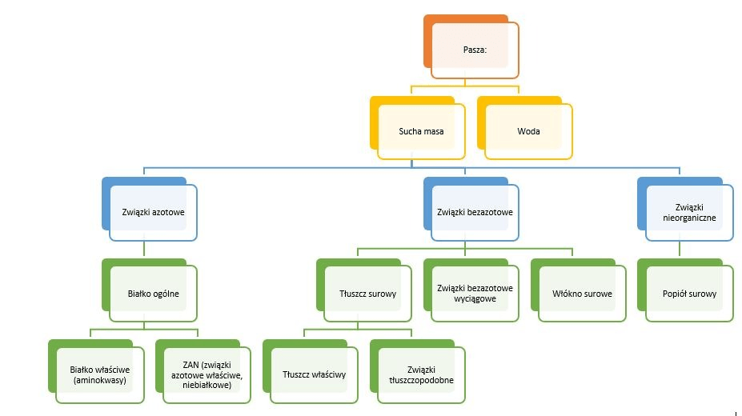

# Paszkoznawstwo

## Kolokwium 9.06
- definicja paszy
- metoda Weedeńska (rysunek)
- dlaczego popiół nazywamy surowym? (bo może mieć zanieczyszczenia)
- dlaczego białko nazywamy ogólnym?
- podaj def strawności
- podać różnice metoda bilansowa i wskaźnikowa
- cechy dobrego wskaźnika (indykadora)
- czynniki wpływające na strawność, zwierze i pasza

## Kolokwium pasze 23.06
- objętościowe (zaproponować przedstawiciela)
- treściwe (zaproponować przedstawiciela)

## Pasze pochodzenia roślinnego

Pasza - materiał pochodzenia roślinnego, zwierzęcego lub mineralnego stosowany w żywieniu zwierząt gospodarskich

### Podział pasz

- Pasze
  - Mineralne (dodatek, np fosforan, kreda, sól)
  - Treściwe
  - Objętościowe
    - Soczyste
    - Suche

- Pasze
  - energetyczne
  - białkowe
  - witaminowe

- Pasze
  - Mlekopędne
    - Buraki pastewne
    - Młode zielonki
    - Otręby pszenne
    - Młóto
  - Rozmiękczające tkankę tłuszczową
    - Ziarno kukurydzy
    - Ziarno owsa
    - Otręby pszenne
    - Młode zielonki
  - Utwardzające tkankę tłuszczową
    - Nasiona roślin strączkowych
    - Makuch bawełniany, kokosowy
    - żyto

Pasze mogą być jednocześnie z kilku grup.

### Pasze obiętościowe

- zielonki
- siano
- kiszonki
- rośliny okopowe
- wodniste produkty uboczne pochodzenia przemysłowego

#### Zielonki

- zielonki
  - z łąk (trawy)
    - siano
    - kiszonki
  - z upraw polowych (lucerna, koniczyna czerwona)
    - uprawianie na gruntach ornych
    - duże znaczenie w żywieniu zwierząt

#### Lucerna

- Pasza wysokobiałkowe
- roślina wieloletnia (największy plon w 2-3 roku)
- plon zależy od terminu zbioru

- 226g białka / 1kg suchej masy
- wartość biologiczna białka niewiele gorsza od białka zwierzęcego
- gorzej wykorzystywanie przez przeżywacze (wzdęcia)

##### Sub. mineralne

- Ca 16g / kg s.m.
- P 3g / kg s.m. (zwierze musi umieć wykorzystać ogólny fosfor)

##### Zastosowanie

- trzoda chlewna
  - źródło białka
- przeżuwacze
  - źródło włókna (celuloza)

##### Negatywy

- Duza zawartość substancji estrogennych
  - poronienia u owiec i bydła
  - obniżenie płodności
  - zapalenie wymienia
- Może powodować wzdęcia
- Osutka gryczana
- Podawana w dużych ilościach przed udojem psuje smak mleka

##### Char. żywieniowa (świeża masa)

- krowy mleczne 30kg/d
- opasy 20kg/d
- loszki 10kg/d
- tuczniki 6kg/d

#### Kończyna czerwona

- musi być uprawiana w postaci czystej lub byc wsiewana w zboża jare
- najlepszym momentem do zbioru jest okres kwitnienia
- młoda koniczyna 200g/1kg

##### negatywy

- wywołuje wzdęcia
- zawiera estrogenne (choroba koniczynowa)
- niezalecana u owiec

##### Char. żywieniowa (świeża masa)

- krowy mleczne - 40kg/d
- lochy - 15kg/d
- tuczniki 5-15kg/d

#### Kukurydza

- podstawowa pasza roślinna w żywieniu opasów i krów mlecznych
- wykorzystywana w postaci
  - zielonki
  - kiszonki z całych roślin
  - CCM (rozdrobnione kolby kukurydzy bez okryw)

##### Kiszonka

Pasza wysokoenergetyczna, jednak niepełnowartościowa (niska zawartość białka i subs. mineralnych)

- NEL 6.63 MJ/1kg s.m.
- białko surowe 100g/1kg s.m.
- ca 3-4g/1kg s.m.
- P 1.5-3.0g/1kg s.m.

###### Niedobory

Białko uzupełniamy przez dodatek:
- siana
- kiszonek z traw
- mieszanek teściwych
- mocznika

##### Char. żywieniowa (świeża masa)

- bydło 20-40kg/d

### Pasze Treściwe

#### Kukurydza

E 13.8MJ/kg (wartość energetyczna)
BO = 94g/kg (białko ogólne)

- pasza wysokoenergetyczna
  - duża zawartość skrobii
  - duża zawartość tłuszczy 4-5%
- niewielka ilość włukna (celulozy)

##### Właściwości

- Białko o nieskiej wartości biologicznej
- niedobór aminokwasów egzogennych

##### Zastosowanie w żywieniu

- Trzoda chlewna (wycofywana z dawki pokarmowej w końcowym okresie odchowu, powoduje zmianę barwy słoniny na żółtą)
- Drób (bez ogranicznień)

#### Pszenica

E = 12.8MJ/kg
BO = 119g/kg

- Podstawowe zboże w żywieniu człowieka
- wykorzystywana również w żywieniu
  - drobiu (do 50% dawki)
  - trzoda chlewna
- przy stosowaniu dużej ilości przenicy niezbędny jest dodatek karotenoidów
- zawiera arabionskylany zwiększające lepkość treści pokarmowej u młodych zwierząt

#### Jęczmień

E = 11.8MJ/kg
BO = 110g/kg

- Stosujemy w żywieniu drobiu
- niosek i stad rodzicielksich
- ze względu na duża zawartość włókna nie stosuje sie dużych ilości tego zboża w żywieniu kurcząt broilerów (do 10%)
- wykorzystywany w żywieniu trzody chlewnej
- stosowany w żywieniu koni jako zamiennik owsa

### Pasze treściwe

#### Poekstrakcyjna śruta sojowa (po wytłoczeniu oleju)

E = 9.2MJ/kg
BO = 450g/kg

Lektyny i inhibitory trypsyny (substancje antyżywieniowe) zostają unieszkodliwione w procesie tostowania

posiada wysoką wartość biologiczną białka (bogata w aminokwasy egzogenne - lizynę)

P = 2.2g/kg (zboża 1.1-1.6g/kg)

##### Wykorzystanie

- Drób
- Trzoda chlewna
- Młode przeżuwacze
- Psy
- Koty

#### Poekstrakcyjna śruta rzepakowa (po wytłoczeniu oleju)

E = 7.8MJ/kg
BO = 351g/kg

- nasiona rzepaku zawierają glukozynolany (zaburza metabolizm jodu i hormonów tarczycy)
- zawartość włókna 12%
- u drobiu może stanowić max 10% dawki

### Pasze naturalne

- zielonki
- kiszonki
- okopowe
- siana
- plewy

### Pasze przemysłowe

- otręby
- śruty poekstrakcyjne
- młóto
- wysłodki buraczane

## Pasze pochodzenia zwierzęcego

### Pasze naturalne

- mleko
- jaja
- ryby
- krew

### Pasze przemysłowe

- serwatka
- mączka z krwi
- mączka rybna

## Pasze pochodzenia mineralnego

## Związki zawarte w paszach

- Białka
- Tłuszcze
  - zielonki 1%
  - Rośliny okopowe 0.2%
  - siano 2-3%
  - ziarna zbóż 4-5%
  - len, rzepak 35-45%
- Węglowodany
- Sub. mineralne
- Witaminy

## Metoda badań

### Weedeńska (będzie na kolokwium)

 

- sucha masa
- popiół surowy
- włukno surowe
- tłuszcz surowy
- białko ogólne
- BAW (związki azotowe niebiałkowe)

### Analiza

Sucha masa + woda = 100%

Suszenie w $105^oC$

### Zawartość wody

- zielonki 80%
- okopowe 76-88%
- ziarno zbóż 12-14%
- siano 15%
- śruty poekstrakcyjne 10-12%
- wywary gorzelniane 95%

### Popiół surowy (surowy bo może mieć zanieczyszczenia)

Związki nieorganiczne paszy które oznacza się przez spalenie próbki umieszczonej w żaroodpornym tyglu w temp 500-550*C

#### Zawartość

- zielonki 2-5%
- Okopowe 1.2-1.4%
- ziarna, nasiona i otręby 2-5%
- słomach i sianach 4.5-8%
- mączki pochodzenia zwierzęcego 20-30%

### Substancja organiczna

- Białko ogólne - zaliczamy wszystkie składniki zawierające azot (ogólny bo ...)
  - Białko właciwe
  - związki azotowe niebiałkowej
- Związki bezazotowe

#### Zawartość

- zielonki 1-4%
- Okopowe 1-2%
- ziarna zbóż 9-14%
- słomach i sianach 22-45%
- mączki pochodzenia zwierzęcego 50-80%

### Związki bezazotowe

#### Tłuszcz surowy

#### Węglowodany

- trudnorozpuszczalne (trudno strawne)
  - włókno surowe
- łatworozpuszczalne (łatwo strawnych)
  - bezazotowe wyciągowe

#### bezazotowe wyciągowe

# Ćwiczenia Pasze

## Zawartość składników pokarmowych

### Ćw. 9

- N% = $0.35\%$
- ${\color{red}\text{współczynnik podsuszenia}} = 0.244$
- swieże-suche = $\frac{100}{23} = 4.35$

| Składniki pokarmowe % | Materiał świeży                   | Materiał podsuszony           | W suchej masie           |
| --------------------- | --------------------------------- | ----------------------------- | ------------------------ |
| Woda                  | $100-23 = 77.0$                   | $-$                           | $0.0$                    |
| Sucha masa (SM)       | $\color{green}23.0$               | $-$                           | $100$                    |
| Białko ogólne         | $0.35\% \cdot 6.25 = 2.19$        | $\frac{2.19}{0.244} = 8.98$   | $2.19\cdot4.35 = 9.53$   |
| Tłuszcz surowy        | $0.8\cdot0.244 = 0.20$            | $\color{green}0.8$            | $0.8\cdot4.35 = 3.48$    |
| Włókno surowe         | $3.3\cdot0.244 = 0.81$            | $\color{green}3.3$            | $3.3\cdot4.35 = 14.35$   |
| Popiół surowy         | $7.4\cdot0.244 = 1.81$            | $\color{green}7.4$            | $7.4\cdot4.35 = 32.19$   |
| Związki BAW           | $23-(2.19+0.2+0.81+1.81) = 17.99$ | $\frac{17.99}{0.244} = 73.73$ | $17.99\cdot4.35 = 78.26$ |

### Ćw. 10

- N% = $6.068\%$
- swieże-suche = $\frac{100}{88.2} = 1.14$

| Składniki pokarmowe % | Materiał świeży                     | Materiał podsuszony | W suchej masie           |
| --------------------- | ----------------------------------- | ------------------- | ------------------------ |
| Woda                  | $100-88.2 = 11.8$                   | $-$                 | $0.0$                    |
| Sucha masa (SM)       | $\color{green}88.2$                 | $-$                 | $100$                    |
| Białko ogólne         | $6.068\cdot6.25 = 37.93$            | $-$                 | $37.93\cdot1.14 = 43.24$ |
| Tłuszcz surowy        | $2.4$                               | $\color{green}2.4$  | $2.4\cdot1.14 = 2.74$    |
| Włókno surowe         | $11.0$                              | $\color{green}11.0$ | $11.0\cdot1.14 = 12.54$  |
| Popiół surowy         | $7.5$                               | $\color{green}7.5$  | $7.5\cdot1.14 = 8.55$    |
| Związki BAW           | $88.2-(37.93+2.4+11.0+7.5) = 29.37$ | $-$                 | $29.37\cdot1.14 = 33.48$ |

## Wyznaczanie strawności

### Metoda bilansowa

- WS (%) = $\frac{\text{g pobrane z paszy} - \text{g wydalone w kale}}{\text{g pobrane z paszy}} \cdot 100$
- WS (%) = $\frac{\text{g strawione}}{\text{g pobrane z paszy}} \cdot 100$

### Metoda wskaźnikowa

- WS (%) = $100-100\cdot\frac{\text{\% wskaź. w paszy}}{\text{\% wskaź. w kale}}\cdot\frac{\text{\% skł. w kale}}{\text{\% skł. w paszy}}$

### Ćw. 9

- pobrano 5.8kg paszy
- wydalono 3.7kg w kale
- wsp. wskaźnika: $\frac{0.5}{0.794} = 0.6297$

| Składnik  | Białko | Tłuszcz | Włókno | BAW    | $Cr_2O_3$ |
| --------- | ------ | ------- | ------ | ------ | --------- |
| Pasza (%) | $2.2$  | $0.2$   | $0.8$  | $18.0$ | $0.5$     |
| Kał (%)   | $1.1$  | $0.1$   | $0.4$  | $0.9$  | $0.794$   |

Metoda bilansowa:

| Składnik            | Białko                   | Tłuszcz                | Włókno                  | BAW                         |
| ------------------- | ------------------------ | ---------------------- | ----------------------- | --------------------------- |
| Skł. pobrane (g)    | $0.022\cdot5.8 = 128$    | $0.002\cdot5.8 = 12$   | $0.008\cdot5.8 = 46$    | $0.18\cdot5.8 = 1044$       |
| Skł. wydalone (g)   | $0.011\cdot3.7 = 41$     | $0.001\cdot3.7 = 4$    | $0.004\cdot3.7 = 15$    | $0.009\cdot3.7 = 33$        |
| Skł. strawione (g)  | $128-41 = 87$            | $12-4 = 8$             | $46-15 = 31$            | $1044-33 = 1011$            |
| Wsp. strawności (%) | $\frac{87}{128} = 67.97$ | $\frac{8}{12} = 67.00$ | $\frac{31}{46} = 67.40$ | $\frac{1011}{1044} = 96.84$ |

Metoda wskaźnikowa:

| Składnik            | Białko                                           | Tłuszcz                                 | Włókno                                  | BAW                                    |
| ------------------- | ------------------------------------------------ | --------------------------------------- | --------------------------------------- | -------------------------------------- |
| Wsp. strawności (%) | $100-100\cdot0.6297\cdot\frac{1.1}{2.2} = 68.51$ | $100-62.97\cdot\frac{0.1}{0.2} = 68.51$ | $100-62.97\cdot\frac{0.4}{0.8} = 68.51$ | $100-62.97\cdot\frac{0.9}{18} = 96.85$ |

### Ćw. 10

- pobrano 0.8kg paszy
- wydalono 0.32kg w kale
- wsp. wskaźnika: $\frac{0.5}{1.25} = 0.4$

| Składnik  | Białko | Tłuszcz | Włókno | BAW    | $Cr_2O_3$ |
| --------- | ------ | ------- | ------ | ------ | --------- |
| Pasza (%) | $37.9$ | $2.4$   | $11.0$ | $29.4$ | $0.50$    |
| Kał (%)   | $20.9$ | $2.3$   | $17.1$ | $16.2$ | $1.25$    |

Metoda bilansowa:

| Składnik            | Białko                    | Tłuszcz                 | Włókno                 | BAW                       |
| ------------------- | ------------------------- | ----------------------- | ---------------------- | ------------------------- |
| Skł. pobrane (g)    | $0.379\cdot0.8 = 303$     | $0.024\cdot0.8 = 19$    | $0.11\cdot0.8 = 88$    | $0.294\cdot0.8 = 235$     |
| Skł. wydalone (g)   | $0.209\cdot0.32 = 67$     | $0.023\cdot0.32 = 7$    | $0.171\cdot0.32 = 55$  | $0.162\cdot0.32 = 52$     |
| Skł. strawione (g)  | $303-67 = 236$            | $19-7 = 12$             | $88-55 = 33$           | $235-52 = 183$            |
| Wsp. strawności (%) | $\frac{236}{303} = 77.89$ | $\frac{12}{19} = 63.16$ | $\frac{33}{88} = 37.5$ | $\frac{183}{235} = 77.87$ |

Metoda wskaźnikowa:

| Składnik            | Białko                                            | Tłuszcz                                  | Włókno                                  | BAW                                      |
| ------------------- | ------------------------------------------------- | ---------------------------------------- | --------------------------------------- | ---------------------------------------- |
| Wsp. strawności (%) | $100-100\cdot0.4\cdot\frac{0.209}{0.379} = 77.94$ | $100-40\cdot\frac{0.023}{0.024} = 61.67$ | $100-40\cdot\frac{0.171}{0.11} = 37.82$ | $100-40\cdot\frac{0.162}{0.294} = 77.96$ |
