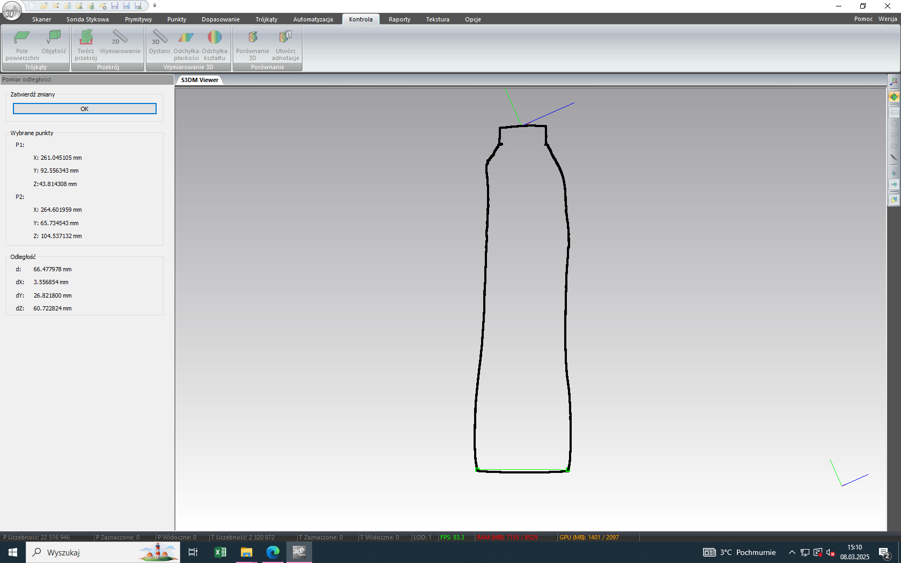
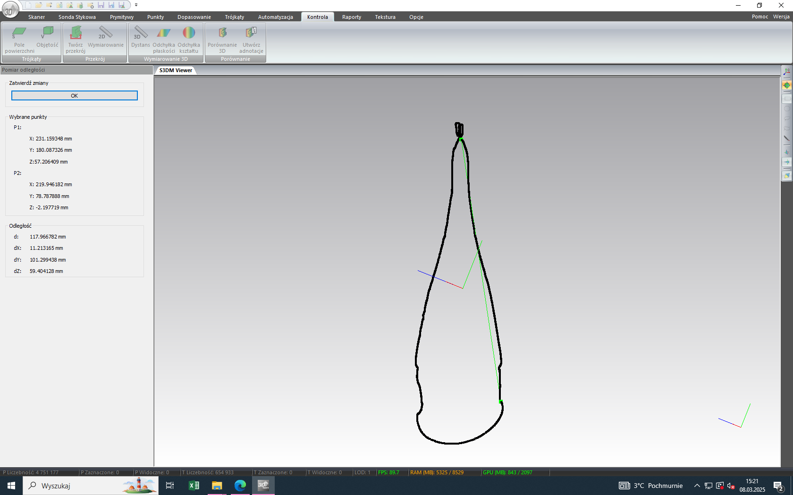
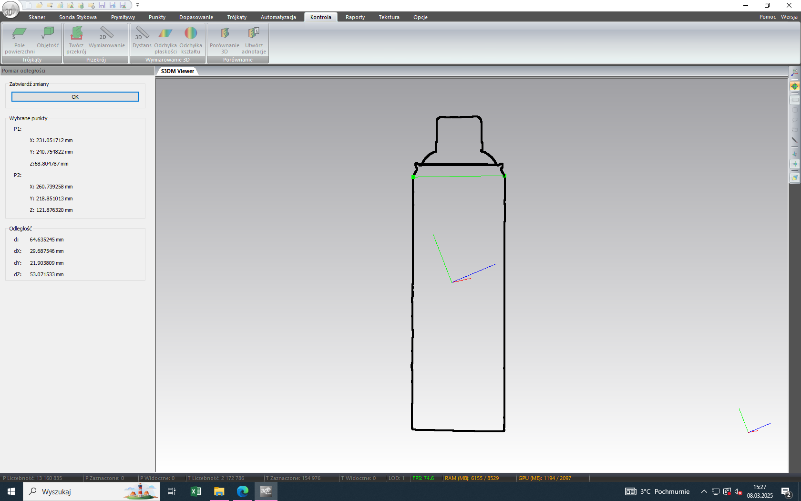
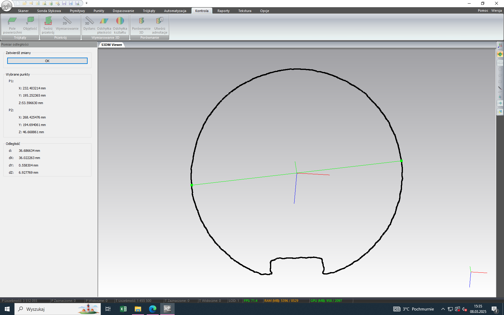
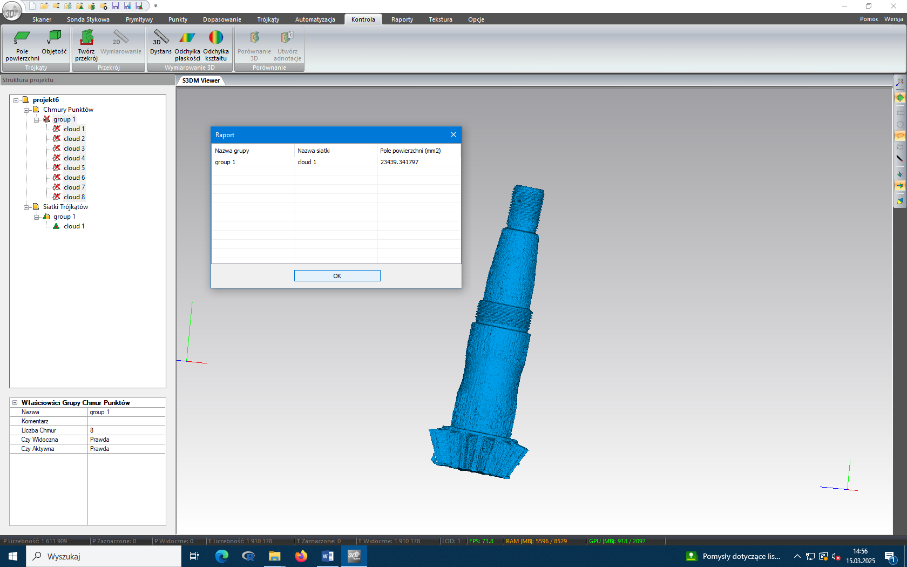

# Wykład

## Kolokwium

- 3 przykłady mechanizmów stosowanych w technice rolniczej
- 2/3 przykłady zwiększania i zmniejszania tarcia w rolnictwie
- 2/3 przykłady połączeń rozłącznych i nierozłącznych
- spawanie - temperatury
- rodzaje lutowania (miękkie, twarde )
- 3 przykłady rozłącznych
- żelazo ruda, stop <2% - stal, >3.8% żeliwo
- co to jest stop brązu i mosiądzy
- różnice oś nie przenosi momentu obrotowego - wał już tak
- przykłady wałów
- łożysko ślizgowe / toczne
- przekładnie

- prędkość kątowa
- prędkość obrotowa
- moment siły

- napęd hydrauliczny - zastosowanie (5 przykładów), wady zalety, prosty układ hydrauliczny

## Napędy w maszynach rolniczych

- napęd hydrauliczny
-


# Ćwiczenia

kolokwium - opis oznaczenia parametrów opony

## Technika pomiarowa 3D / Skaner 3D

Producent: smarttech 3D
Model: universe 5 mpix
Pole pomiarowe: 400x300x240mm
Niepewność pomiaru: 0.08mm

Wykorzystanie: tworzenie modelu 3d obiektu i jego analiza

## Sprawozdanie

### Teoria

Skanery 3D to urządzenia, które umożliwiają cyfrowe odwzorowanie rzeczywistych obiektów w formie trójwymiarowych modeli. Wykorzystują różne technologie, takie jak skanowanie laserowe, fotogrametria czy skanowanie strukturalne. Skanery 3D znajdują zastosowanie w wielu dziedzinach, takich jak inżynieria, architektura, medycyna, sztuka czy przemysł rozrywkowy. Dzięki nim można tworzyć modele do analizy, projektowania, produkcji czy rekonstrukcji. Skanery 3D są również wykorzystywane w procesach kontroli jakości, gdzie umożliwiają dokładne pomiary i porównania z modelami CAD.

### Smarttech 3D

Urządzenie Smarttech 3D Universe 5Mpix to skaner 3D, który umożliwia dokładne pomiary i tworzenie modeli trójwymiarowych. Dzięki zastosowaniu technologii skanowania laserowego, urządzenie to jest w stanie uchwycić szczegóły obiektów o różnych kształtach i rozmiarach. Oprogramowanie Smarttech 3D Measure pozwala na analizę danych pomiarowych oraz generowanie raportów.

### Pomiary

#### Projekt 1: Butelka Tymbark

| Pomiar                 | Wartość      |
| ---------------------- | ------------ |
| Powierzchnia całkowita | 69970.63 mm² |
| Powierzchnia korka     | 2065.12 mm²  |
| Wysokość               | 252.69 mm    |
| Szerokość boku         | 66.47 mm     |



#### Projekt 2: Kubek

| Pomiar                 | Wartość      |
| ---------------------- | ------------ |
| Powierzchnia całkowita | 44993.18 mm² |
| Powierzchnia ucha      | 4319.41 mm²  |
| Średnica               | 79.49 mm     |
| Wysokość               | 97.39 mm     |


#### Projekt 3: Krem do rąk

| Pomiar                                        | Wartość      |
| --------------------------------------------- | ------------ |
| Powierzchnia całkowita                        | 18155.78 mm² |
| Szerokość u podstawy zgrzewu                  | 59.38 mm     |
| Wysokość od szczytu zgrzewu do podstawy korka | 117.97 mm    |
| Szerokość korka                               | 35.05 mm     |



#### Projekt 4: Wywoływacz

| Pomiar                 | Wartość      |
| ---------------------- | ------------ |
| Powierzchnia całkowita | 53695.98 mm² |
| Powierzchnia korka     | 3353.04 mm²  |
| Średnica korka         | 33.46 mm     |
| Średnica puszki        | 64.64 mm     |



#### Projekt 5: Wałek

| Pomiar                 | Wartość      |
| ---------------------- | ------------ |
| Powierzchnia całkowita | 17969.29 mm² |
| Głębokość wcięcia      | 2.28 mm      |
| Szerokość wcięcia      | 9.14 mm      |
| Średnica wałka         | 36.68 mm     |



#### Projekt 6: Wałek atakujący

powierzchnia całkowita: 23439.34mm^2
zewnętrzna średnica większego gwwintu: 31.32mm
skok większego gwintu: 1.51mm
głębokość gwintu: 10.45mm



#### Projekt 7: Opona rolnicza

$hu [mm]$ = wysokość maksymalnego ugięcia\
$A_{hu} [m^2]$ = powierzchnia w maksymalnym pkt ugięcia\
$N_j = [\frac{N}{m^2}=Pa]$ = nacisk jednostkowy

0.8x800D = 85mm / 365802.15mm^2 = 21454.22 = 21.45kPa

nacisk jednostkowy
$N_j = \frac{800kg \cdot 9.81\frac{m}{s^2}}{365802.15mm^2} = \frac{7848}{0.365802} = 21454.22 Pa = 21.45kPa$

0.8x800r = 70mm / 378438.93mm^2 = 20737.82 = 20.73kPa
0.8x1600D = 60mm / 348729.18mm^2 = 45009.13 = 45.00kPa
0.8x1600r = 52mm / 369184.59mm^2 = 42515.31 = 42.51kPa
2.4x800D = 105mm / 411819.56mm^2 = 19056.88 = 19.05kPa
2.4x800r = 84mm / 378133.96mm^2 = 20754.54 = 20.75kPa
2.4x1600D = 94mm / 392705.40mm^2 = 39968.89 = 39.96kPa
2.4x1600r = 73mm / 364090.65mm^2 = 43110.14 = 43.11kPa

Wnioski

### Wnioski

Podczas pomiarów zauważono, że niektóre wartości były trudne do uchwycenia z powodu kształtu obiektów. Na przykład, w przypadku butelki Tymbark, pomiar szerokości boku był trudny do wykonania z powodu zaokrąglonego kształtu. W przypadku kubka, pomiar średnicy był dokładny, ale wymagał precyzyjnego ustawienia w programie. Wnioskując, dokładność pomiarów zależy od kształtu obiektu oraz umiejętności operatora oprogramowania.

## Budowa korpusu pługów

- lemiesz
- okładnica
- słupica
- płóż
- piętka
- listwa usztywniająca
-

### Zależności
- $\tan(\alpha) = \frac{OC}{OB}$
- $\tan(\beta) = \frac{OC}{OA}$
- $\tan(\gamma) = \frac{OA}{OB}$
- $\tan(\epsilon) = \frac{OC}{OA'}$
- $\tan(\tau) = \frac{OB}{OC'}$

```
  |\
  | \
  |  \ c
a |   \
  |.  X\
  -------
    b
```

tg(x) = a/b
ctg(x) = b/a
sin(x) = a/c
cos(x) = b/c

### Zad

Proszę wyprowadzić wzór i obliczyć wartość kąta wzniosu ($\alpha$) w klinie trójgraniastym, jeśli:
$\beta = \frac{OC}{OA}$ - kąt (pochylenia) obracania skiby - $25\degree$
$\gamma = \frac{OA}{OB}$ - kąt przystawienia - $35\degree$

$$
\tan(\alpha) = \frac{OC}{OB}\\
OC = \frac{OC}{OA} =  \\
OB =
\tan(\alpha) = \frac{}{}\\
$$

$$
tan(\alpha) = \frac{OC}{OB}
\tan(\beta) = \frac{OC}{OA} // *OA
OC = \tan(beta) * OA
\tan(\gamma) = \frac{OA}{OB} // *OB
OB = \tan(\gamma) * OA
\tan(\alpha) = \frac{\tan(beta)}{\tan(\gamma)}
$$
