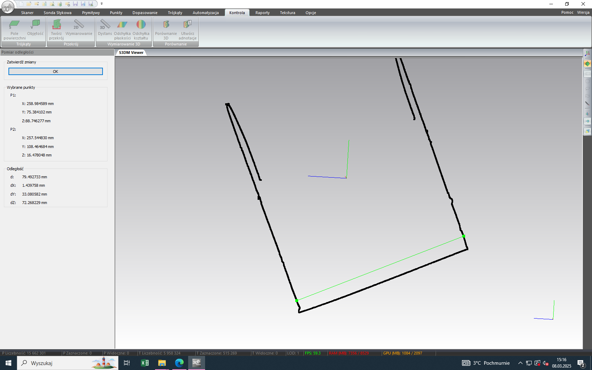

# Wykład

## Kolokwium

- 3 przykłady mechanizmów stosowanych w technice rolniczej
- 2/3 przykłady zwiększania i zmniejszania tarcia w rolnictwie
- 2/3 przykłady połączeń rozłącznych i nierozłącznych
- spawanie - temperatury
- rodzaje lutowania (miękkie, twarde )
- 3 przykłady rozłącznych
- żelazo ruda, stop <2% - stal, >3.8% żeliwo
- co to jest stop brązu i mosiądzy
- różnice oś nie przenosi momentu obrotowego - wał już tak
- przykłady wałów
- łożysko ślizgowe / toczne
- przekładnie

- prędkość kątowa
- prędkość obrotowa
- moment siły
-

# Ćwiczenia

## Technika pomiarowa 3D / Skaner 3D

Producent: smarttech 3D
Model: universe 5 mpix
Pole pomiarowe: 400x300x240mm
Niepewność pomiaru: 0.08mm

Wykorzystanie: tworzenie modelu 3d obiektu i jego analiza

## Sprawozdanie

### Teoria

Skanery 3D to urządzenia, które umożliwiają cyfrowe odwzorowanie rzeczywistych obiektów w formie trójwymiarowych modeli. Wykorzystują różne technologie, takie jak skanowanie laserowe, fotogrametria czy skanowanie strukturalne. Skanery 3D znajdują zastosowanie w wielu dziedzinach, takich jak inżynieria, architektura, medycyna, sztuka czy przemysł rozrywkowy. Dzięki nim można tworzyć modele do analizy, projektowania, produkcji czy rekonstrukcji. Skanery 3D są również wykorzystywane w procesach kontroli jakości, gdzie umożliwiają dokładne pomiary i porównania z modelami CAD.

### Smarttech 3D

Urządzenie Smarttech 3D Universe 5Mpix to skaner 3D, który umożliwia dokładne pomiary i tworzenie modeli trójwymiarowych. Dzięki zastosowaniu technologii skanowania laserowego, urządzenie to jest w stanie uchwycić szczegóły obiektów o różnych kształtach i rozmiarach. Oprogramowanie Smarttech 3D Measure pozwala na analizę danych pomiarowych oraz generowanie raportów.

### Pomiary

#### Projekt 1: Butelka Tymbark

| Pomiar                 | Wartość      |
| ---------------------- | ------------ |
| Powierzchnia całkowita | 69970.63 mm² |
| Powierzchnia korka     | 2065.12 mm²  |
| Wysokość               | 252.69 mm    |
| Szerokość boku         | 66.47 mm     |

#### Projekt 2: Kubek

| Pomiar                 | Wartość      |
| ---------------------- | ------------ |
| Powierzchnia całkowita | 44993.18 mm² |
| Powierzchnia ucha      | 4319.41 mm²  |
| Średnica               | 79.49 mm     |
| Wysokość               | 97.39 mm     |

#### Projekt 3: Krem do rąk

| Pomiar                                        | Wartość      |
| --------------------------------------------- | ------------ |
| Powierzchnia całkowita                        | 18155.78 mm² |
| Szerokość u podstawy zgrzewu                  | 59.38 mm     |
| Wysokość od szczytu zgrzewu do podstawy korka | 117.97 mm    |
| Szerokość korka                               | 35.05 mm     |

#### Projekt 4: Wywoływacz

| Pomiar                 | Wartość      |
| ---------------------- | ------------ |
| Powierzchnia całkowita | 53695.98 mm² |
| Powierzchnia korka     | 3353.04 mm²  |
| Średnica korka         | 33.46 mm     |
| Średnica puszki        | 64.64 mm     |

#### Projekt 5: Wałek

| Pomiar                 | Wartość      |
| ---------------------- | ------------ |
| Powierzchnia całkowita | 17969.29 mm² |
| Głębokość wcięcia      | 2.28 mm      |
| Szerokość wcięcia      | 9.14 mm      |
| Średnica wałka         | 36.68 mm     |

### Wnioski

Podczas pomiarów zauważono, że niektóre wartości były trudne do uchwycenia z powodu kształtu obiektów. Na przykład, w przypadku butelki Tymbark, pomiar szerokości boku był trudny do wykonania z powodu zaokrąglonego kształtu. W przypadku kubka, pomiar średnicy był dokładny, ale wymagał precyzyjnego ustawienia skanera. Wnioskując, dokładność pomiarów zależy od kształtu obiektu oraz umiejętności operatora skanera.
